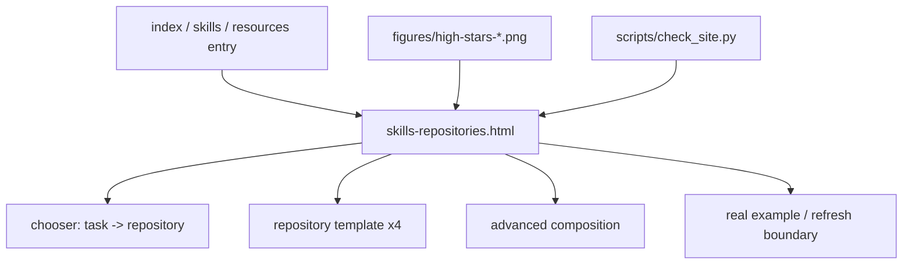

# High Stars Skills Repositories Page - Plan

## Goal Capsule

- **Objective:** Add a Chinese guide page titled `高 stars skills 仓库介绍` that helps Codex Desktop readers choose and start using four high-attention skills repositories, then gives advanced users a compact automation-composition path.
- **Product authority:** User-confirmed scope is `1+3`: prioritize Codex Desktop ordinary users first, then advanced automation users.
- **Execution profile:** Standard docs/UI change in the static GitHub Pages guide; no backend, no PDF rebuild by default, and no internal `doc/` publication.
- **Stop conditions:** Stop if upstream README facts cannot be verified, generated image assets cannot be saved after a retry, local link/image validation fails without a narrow fix, or implementation would require changing the confirmed repository list.
- **Tail ownership:** LFG continues after implementation with simplification/review/browser/static checks and shipping decisions, while preserving unrelated dirty worktree changes.

---

## Product Contract

### Summary

The guide will add one selection-first page for four skills repositories: Compound Engineering, `mattpocock/skills`, `academic-research-skills-codex`, and ARIS.
The first half serves ordinary Codex Desktop users who need to know which repository fits their task and how to invoke it.
The second half serves advanced users who want to combine engineering, academic, and sleep-style research workflows without turning the page into a full automation manual.

Product Contract preservation: unchanged.

### Problem Frame

The current guide already explains Codex Desktop, local skills, Compound Engineering, and the local `goal-entry` experiment in separate places.
Readers still lack a single decision page that compares popular reusable skills repositories by task type.
Without that page, a beginner sees repository names but not the practical choice: engineering discipline, project grilling, academic writing, or automated research workflow.

### Key Decisions

- **Ordinary-user first, advanced-user second.** The page should start with task selection and copyable prompts, then end with a smaller advanced automation section.
- **High-attention, not live ranking.** The title may say `高 stars`, but the body should not hard-code exact star counts unless it also carries a visible data timestamp.
- **Repository pages, not local experiments.** `goal-entry` remains documented as a self-developed local adaptation elsewhere and should not appear as one of the high-stars repositories on this page.
- **Few strong illustrations.** Use about three Ian Xiaohei illustrations for reader cognition: repository chooser, engineering-vs-research split, and sleep-style automation loop.

### Actors

- A1. **Codex Desktop ordinary user:** Wants to choose a skills repository and write the first usable prompt without understanding every skill in advance.
- A2. **Advanced automation user:** Wants to combine long-running engineering or research workflows and needs warnings about boundaries.
- A3. **Guide maintainer:** Needs factual, source-bounded repository summaries that can be refreshed when upstream README files change.

### Requirements

**Page shape**

- R1. The page must be titled `高 stars skills 仓库介绍` and read as a decision guide, not a ranking table.
- R2. The opening section must explain that the page compares reusable skills repositories by task fit, install/use path, and example prompt.
- R3. The page must include a compact chooser that maps common tasks to a primary repository and, when useful, one secondary repository.

**Repository coverage**

- R4. Compound Engineering must be presented as an engineering workflow plugin for brainstorm, plan, work, simplify, review, and compound-learning loops.
- R5. `mattpocock/skills` must be presented as a small, composable engineering-skills set focused on grilling, shared language, TDD, debugging, and codebase design.
- R6. `academic-research-skills-codex` must be presented as the repository, `skills/academic-research-suite` as its Codex skill path, and ARS as a short label for the suite's academic research workflows.
- R7. `auto-claude-code-research-in-sleep` must be presented as ARIS, a research workflow/methodology for planning, drafting, adversarial review, iteration, and persistence, with Codex/skills entry points mentioned without expanding the full ecosystem.

**Per-repository template**

- R8. Each repository section must include capability, best-fit use cases, shortest install or enable path, first prompt example, and usage boundary.
- R9. Each repository section must link to the upstream repository and avoid implying that third-party skills are OpenAI official features.
- R10. Examples must be copyable prompts written for Codex Desktop users, not abstract descriptions.

**Advanced automation section**

- R11. The advanced section must show how to combine the four repositories by workflow stage: engineering planning, engineering discipline, academic work, and autonomous research.
- R12. The advanced section must warn that long-running automation still needs scoped objectives, source trust boundaries, validation evidence, and human approval for external write actions.

**Illustrations**

- R13. The page must include about three Ian Xiaohei 16:9 illustrations, inserted near the chooser, the engineering/research split, and the advanced automation section.
- R14. Each illustration must carry one core idea, use pure white background, sparse black hand-drawn line art, restrained red/orange/blue Chinese annotations, and 小黑 as the core action subject.
- R15. Illustration text must stay short and robust to generation errors; the page must not depend on image text for factual instructions.

### Key Flows

- F1. **Ordinary user choosing a repository**
  - **Trigger:** The reader has a task but does not know which skills repository to use.
  - **Actors:** A1.
  - **Steps:** Reader scans the chooser, jumps to the repository section, copies the first prompt, and follows the shortest install/enable path.
  - **Outcome:** Reader can start a Codex Desktop thread with a bounded prompt and source link.

- F2. **Advanced user composing workflows**
  - **Trigger:** The reader wants a longer engineering or research automation flow.
  - **Actors:** A2.
  - **Steps:** Reader maps the work to stages, selects a repository for each stage, writes validation and approval boundaries, and avoids mixing every repository into one giant prompt.
  - **Outcome:** Reader has a staged automation strategy rather than a vague all-agent request.

- F3. **Maintainer refreshing factual content**
  - **Trigger:** An upstream repository changes install steps, skill names, or supported Codex surfaces.
  - **Actors:** A3.
  - **Steps:** Maintainer checks upstream README files, updates the affected repository section, and reruns the static guide check.
  - **Outcome:** The page stays source-bounded and avoids stale claims.

### Acceptance Examples

- AE1. **Covers R3, R8, R10.** Given a reader wants to "make a product change safely", when they open the page, then they should be guided toward Compound Engineering or `mattpocock/skills` with a concrete first prompt.
- AE2. **Covers R6, R7.** Given a reader wants to "write or review an academic paper", when they compare research repositories, then they should understand the difference between Codex-native ARS and ARIS-style research automation.
- AE3. **Covers R13-R15.** Given images fail to load or contain imperfect generated labels, when the reader uses the page, then all factual instructions remain available in text.

### Success Criteria

- The page helps a beginner pick one repository in under 60 seconds.
- Each repository section includes one copyable prompt that could start a real Codex Desktop task.
- The advanced section shows composition without encouraging unbounded unattended automation.
- Static guide validation passes after implementation.

### Scope Boundaries

- `goal-entry` is out of the high-stars repository list because it is a self-developed local experiment with average practical effect.
- Exact live star counts are out of scope unless the implemented page adds a visible update date and a refresh process.
- Full troubleshooting manuals for each repository are out of scope; the page links upstream for details.
- Generating more than three or four illustrations is out of scope unless the implemented page becomes much longer than planned.

---

## Planning Contract

### Key Technical Decisions

- KTD1. **Create `skills-repositories.html` as a task/resource page.** A dedicated page keeps the repository comparison readable and avoids overloading `skills.html`, which should remain the generic concept page; the file name avoids making `stars` a permanent URL contract while the visible title stays `高 stars skills 仓库介绍`.
- KTD2. **Use existing HTML/CSS primitives before adding styling.** The current guide already has `hero compact`, `doc-layout`, `side-nav`, `content-block`, `bento`, `source-card`, `decision-table`, `figure-card`, `mini-list`, and `tier-badge`; the new page should reuse those unless the illustration layout exposes a real gap.
- KTD3. **Link the page from reader decision surfaces, not every top nav item.** Add discoverability from `index.html`, `resources.html`, `skills.html`, and `workflows.html`; do not modify `CORE_NAV` or add this page to the global top navigation.
- KTD4. **Make upstream facts visible and bounded.** Each repository section should name its source URL and say third-party skills are not OpenAI official features; exact star counts remain absent. For Academic Research, use `academic-research-skills-codex` for the repository, `skills/academic-research-suite` for the install path, and ARS only as the suite shorthand.
- KTD5. **Use generated images as cognitive support, not instruction carriers.** The page text must contain every install path, prompt, boundary, and validation statement; image labels can be short mood/structure hints only.

### Assumptions

- The current static site can host image assets under `figures/` without build tooling changes.
- The `image_gen` output can be saved or otherwise made available as local image files before final insertion; if not, implementation must retry once and then stop with a clear blocker rather than inserting dead links.
- A static site check is sufficient for this docs change; no PDF rebuild is required because AGENTS.md excludes PDF generation from the default completion contract.
- Upstream README files are authoritative for install and workflow names at planning time, but the page should still link upstream because those facts can change.

### High-Level Technical Design

### Chooser Taxonomy

| Reader task | Primary repository | Secondary option | Tie-break |
|---|---|---|---|
| 多步骤工程功能或复杂 bug | Compound Engineering | `mattpocock/skills` | 需要完整 brainstorm-plan-work-review 闭环时选 Compound；只想先拷问需求或收紧工程纪律时选 Matt Pocock skills。 |
| 需求还模糊、想被追问 | `mattpocock/skills` | Compound Engineering | 先用 `grill-with-docs` / `ask-matt` 对齐语言；范围稳定后再进入 Compound loop。 |
| 学术检索、论文写作、论文审稿 | `academic-research-skills-codex` | ARIS | Codex Desktop 内需要单个 suite 入口时选 ARS；需要更长的自动科研管线时再看 ARIS。 |
| 睡眠式自动科研或多轮研究流水线 | ARIS | `academic-research-skills-codex` | 长任务、可配置自动评审和研究 wiki 选 ARIS；只需要 Codex-native 学术工作流选 ARS。 |
| 不知道该装哪个 | `mattpocock/skills` | Compound Engineering | 先用 `ask-matt` 或 grill 类 skill 让任务变清楚，再选择更重的工程流程。 |

### Sources & Research

- EveryInc Compound Engineering README currently describes the six-step loop as brainstorm, plan, work, simplify, review, and compound, with Codex App installation through a custom marketplace source `EveryInc/compound-engineering-plugin`.
- `mattpocock/skills` README positions the skills as small, adaptable, composable engineering practices and names setup through `npx skills@latest add mattpocock/skills` plus `/setup-matt-pocock-skills`.
- `academic-research-skills-codex` README presents a Codex-native single-suite package at `skills/academic-research-suite`, versioned independently from the Claude Code distribution; the page may abbreviate the suite as ARS after this mapping is introduced.
- ARIS README positions ARIS as a methodology rather than a platform and names Codex/skills entry points plus project-local Codex installation/update scripts.

### Risks & Dependencies

- **Upstream drift:** Install paths, versions, and skill names may change. Mitigation: keep source links visible and add static required text only for stable page claims.
- **Image generation mismatch:** Generated labels may be imperfect. Mitigation: keep factual instructions in text and use short captions.
- **Navigation bloat:** Adding another top-nav item can make the pill navigation crowded. Mitigation: link from relevant decision pages first and leave `CORE_NAV` unchanged unless validation or usability requires promotion.
- **Dirty worktree:** The repo already contains unrelated or previous uncommitted guide changes. Mitigation: inspect diffs before staging and stage only files touched for this task if shipping proceeds.

---

## Implementation Units

### U1. Source-bounded repository content

- **Goal:** Write the content model for the four repository sections and chooser using verified upstream README facts.
- **Requirements:** R1-R12, AE1-AE2.
- **Dependencies:** None.
- **Files:** `skills-repositories.html`.
- **Approach:** Create the page skeleton with a compact hero, side-nav anchors, chooser, four repository sections using one repeated template, advanced composition, refresh boundary, and real example. Use Chinese-first prose while preserving exact English names such as `Compound Engineering`, `mattpocock/skills`, `academic-research-suite`, `ARIS`, `SKILL.md`, and command names.
- **Patterns to follow:** `compound-engineering.html` for plugin/source treatment; `resources.html` for source cards; `skills.html` for skill boundary wording.
- **Test scenarios:** Covers AE1 and AE2. A reader with an engineering task can choose Compound Engineering or Matt Pocock skills from the chooser, jump to that section, and copy a first prompt. A reader with an academic writing/review task can distinguish `academic-research-suite` from ARIS. A maintainer can see upstream source links without relying on live star counts.
- **Verification:** The page has non-empty `<title>` and `<h1>`, all side-nav anchors exist, each repository section includes capability, best-fit use cases, install or enable path, prompt example, usage boundary, and upstream link.

### U2. Reader entry points and public docs

- **Goal:** Make the new page discoverable from existing reader routes without turning it into a global concept page.
- **Requirements:** R2-R3, R8-R10, F1-F3.
- **Dependencies:** U1.
- **Files:** `index.html`, `resources.html`, `skills.html`, `workflows.html`, `README.md`.
- **Approach:** Add a `Skills 仓库怎么选` card in the homepage `选择你的路径` section, plus concise links from the resources local-guides section, the generic Skills concept page, and the workflows page. Update README structure to mention the new repository comparison page. Do not publish internal `doc/` task records.
- **Patterns to follow:** Existing `source-card` and `bento` link cards; README's current numbered content structure.
- **Test scenarios:** A beginner starting at `index.html` can reach the page in one click from a relevant card. A maintainer checking `resources.html` can find the page among open-source/plugin references. Existing concept anchors in `skills.html` remain valid.
- **Verification:** Local link checker passes; required page copy is reachable from the homepage and resources map.

### U3. Ian Xiaohei illustration assets

- **Goal:** Generate and insert about three 16:9 Ian Xiaohei-style illustrations that support the chooser, engineering/research split, and advanced automation section.
- **Requirements:** R13-R15, AE3.
- **Dependencies:** U1.
- **Files:** `figures/high-stars-chooser.png`, `figures/high-stars-engineering-research.png`, `figures/high-stars-automation-loop.png`, `skills-repositories.html`.
- **Approach:** Use the `ian-xiaohei-illustrations` style: pure white background, black hand-drawn lines, sparse red/orange/blue Chinese annotations, one small black 小黑 figure doing the core action, no decorative PPT-like layout. Insert images with descriptive `alt` text and captions that do not carry unique factual instructions only after files exist locally.
- **Patterns to follow:** Existing `.figure-card` image usage in `skills.html` and `.split-visual` / `.figure-card` CSS.
- **Test scenarios:** Covers AE3. If one image fails in a reader's browser, the surrounding heading, paragraph, cards, and prompt examples still fully explain the repository choice. During implementation, missing local image files must fail validation rather than ship as broken links. On mobile, image cards remain stacked and text does not overlap.
- **Verification:** All image files exist at referenced paths, render as `` local links, and the page remains understandable from text alone.

### U4. Static validation coverage

- **Goal:** Teach `make check` about the new page's required content and image links.
- **Requirements:** R1-R15, F3.
- **Dependencies:** U1-U3.
- **Files:** `scripts/check_site.py`.
- **Approach:** Add `skills-repositories.html` to task/resource-page validation and require stable phrases such as `高 stars skills 仓库介绍`, the four repository names, `不是 OpenAI 官方功能`, and `真实实例`. Extend `PageParser` to collect `` paths and run them through the existing local-link validation. Avoid requiring exact version or star count text.
- **Patterns to follow:** Existing `REQUIRED_TEXT`, `TASK_PAGES`, and local link/anchor validation.
- **Test scenarios:** Missing the new page, removing a required repository name, breaking an image link, or deleting the real-example section causes `make check` to fail. Normal upstream star-count drift does not affect the check.
- **Verification:** `make check` passes after implementation and fails for a targeted local deletion during reasoning if a quick manual sanity check is needed.

### U5. Final polish, review, and scope hygiene

- **Goal:** Keep the shipped diff focused and readable after implementation and image insertion.
- **Requirements:** Success Criteria, AE1-AE3.
- **Dependencies:** U1-U4.
- **Files:** `skills-repositories.html`, `assets/site.css`, `index.html`, `resources.html`, `skills.html`, `workflows.html`, `README.md`, `scripts/check_site.py`.
- **Approach:** Scan for palette/layout regressions, crowded navigation, broken anchors, stale `goal-entry` positioning, and accidental CLI-first wording. Keep any CSS addition generic and minimal.
- **Patterns to follow:** Project AGENTS.md verification checklist; existing Desktop-first forbidden wording checks.
- **Test scenarios:** The page does not present CLI as the primary path; `goal-entry` remains self-developed and average-effectiveness only on its own/local adaptation surfaces; third-party repositories are never described as official OpenAI capabilities.
- **Verification:** Run `make check`, `git diff --check`, and a browser/static preview check if the environment supports it.

---

## Verification Contract

| Gate | Applies to | Done signal |
|---|---|---|
| `make check` | U1-U4 | Static site parser reports all HTML pages, local links, local image assets, anchors, required text, and task/resource real-example sections are valid. |
| `git diff --check` | U1-U5 | No whitespace errors in the touched files. |
| Browser/static preview | U1-U5 | The new page can be opened locally; images, side-nav anchors, and responsive layout are usable on desktop and narrow widths. |
| Source-boundary scan | U1-U5 | Page copy includes upstream links, avoids exact star counts, and does not call third-party skills OpenAI official features. |

---

## Definition of Done

- `skills-repositories.html` exists and is reachable from the guide's reader routes.
- The page contains the chooser, four repository sections, advanced composition section, and real example with source links.
- Three Ian Xiaohei illustration assets are saved locally and referenced from the page; if generation cannot produce saveable files after retry, the run stops before claiming completion.
- `scripts/check_site.py` validates the new page without brittle live star-count checks.
- `make check` and `git diff --check` pass.
- The final staged/committed scope excludes unrelated dirty worktree files unless the user explicitly asks to include them.
