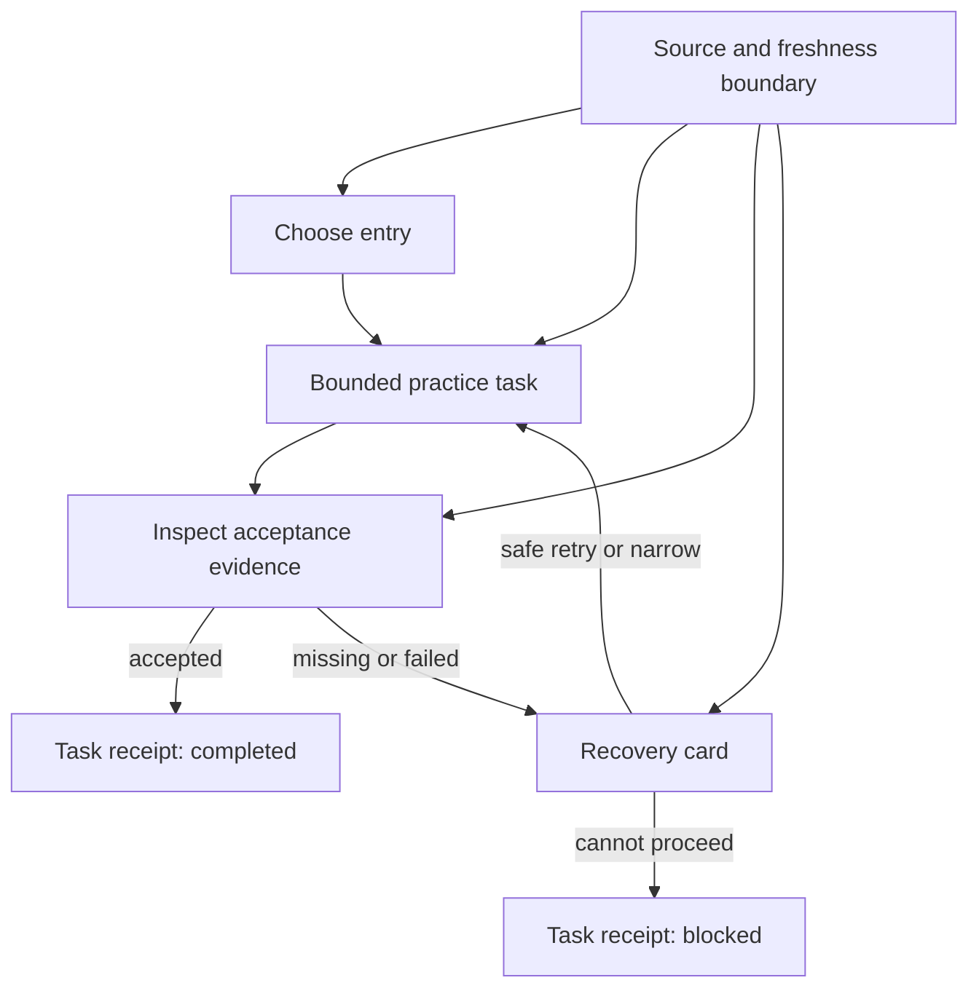
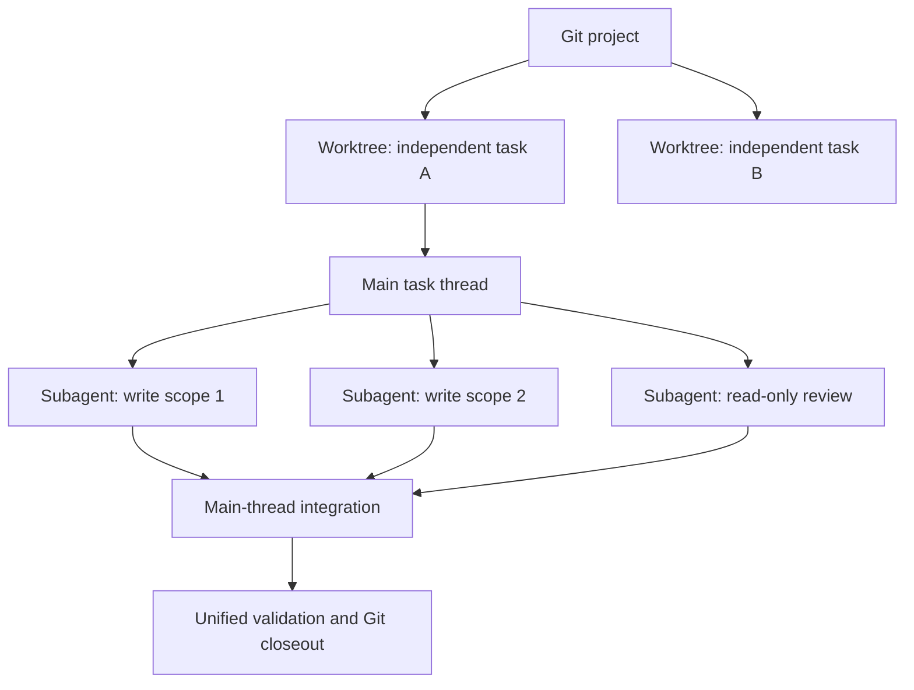
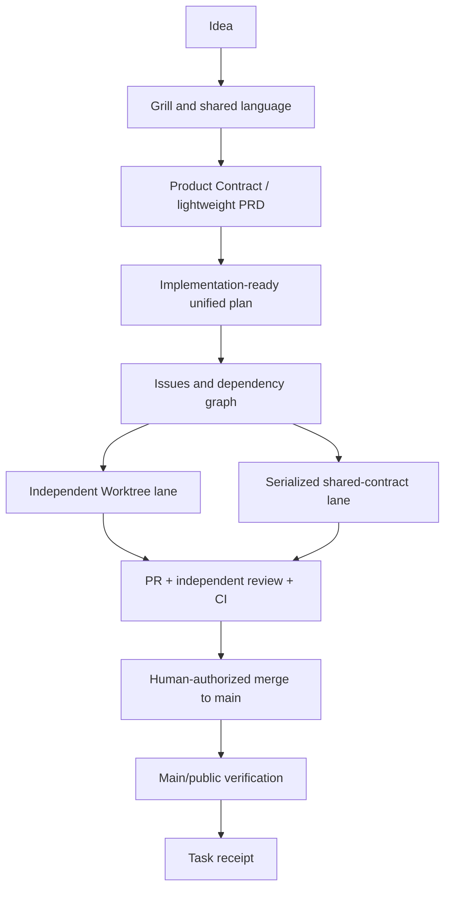
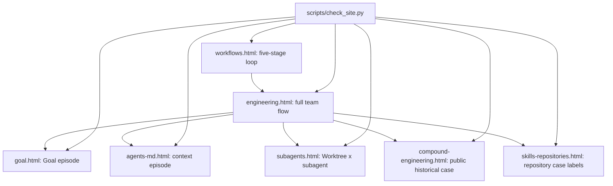
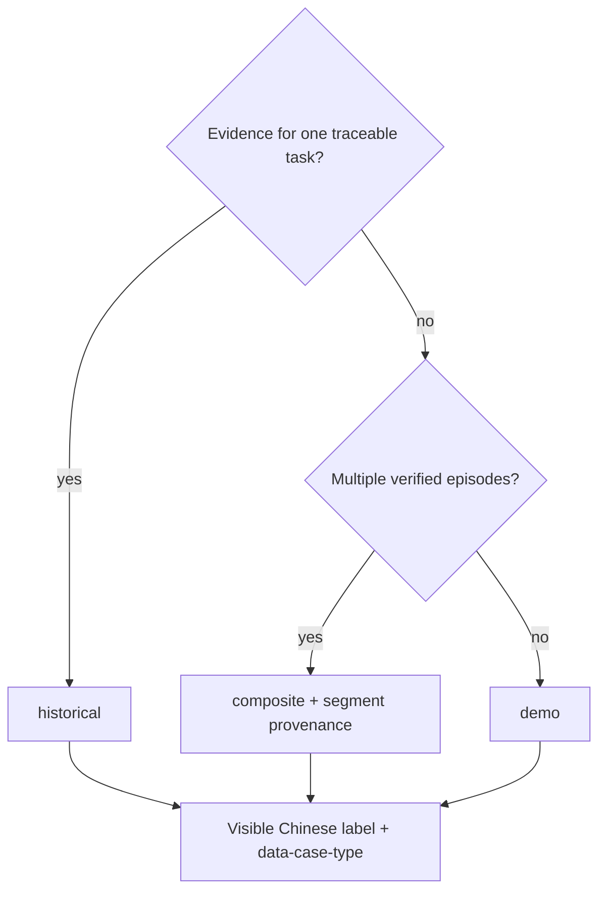

# Evidence-Driven Task Loop and Worktree Subagent Guidance - Plan

## Goal Capsule

- **Objective:** Turn the Codex Desktop guide's scattered task advice into one evidence-driven reader loop, supported by medium-redacted historical cases and a dual human/Codex delivery flow from idea through authorized main-branch merge.
- **Product authority:** The user confirmed one combined plan, medium redaction, a hybrid main-case plus side-case structure, one evolving unified plan, dual role mapping, and dependency-grouped Worktrees.
- **Execution profile:** Deep static-documentation change across seven public HTML pages and the site checker; reuse current CSS, JavaScript, Mermaid, navigation, and image assets.
- **Stop conditions:** Stop if a historical claim cannot be tied to session, Git, plan, PR, test, or publication evidence; if medium redaction cannot preserve privacy; or if the connected flow cannot pass static and browser verification without widening the confirmed scope.
- **Tail ownership:** LFG owns implementation, simplification, independent review, PR creation, and CI watch; a human retains authorization for external publication and final default-branch merge.
- **Open blockers:** None; page ownership, execution units, verification gates, and privacy boundaries are resolved below.

---

## Product Contract

### Summary

The guide will teach one reusable Codex Desktop task loop: choose an entry, practice on a bounded task, verify evidence, recover safely when blocked, and produce a task receipt.
A medium-redacted historical case will carry readers from context and Goal through dependency-grouped Worktrees, PR review, authorized main-branch merge, and closeout, with evidence-backed side cases for Compound Engineering and other third-party Skills.
The change will connect existing guidance through one evolving plan and a dual human/Codex team model instead of expanding the guide with another broad content track.

Product Contract preservation: clarified R26-R27 and R37, added R40-R41 for excerpt depth and Worktree environment boundaries; all other confirmed scope is unchanged.

### Problem Frame

The public guide already contains entry selection, scoped prompt templates, validation evidence, failure stopping, closeout, disjoint subagent write scopes, and main-thread integration.
These ideas are spread across task, Desktop, Goal, subagent, engineering, and automation pages, so a reader must assemble the operating model alone.
The guide also mentions Worktree and subagents separately but does not explain their different isolation responsibilities when several agents write code.
Current examples explain isolated tasks but do not show how a real team moves one idea through requirements, planning, Issues, parallel execution, review, and merge.
As a result, readers can understand individual features without gaining a repeatable way to start, coordinate, judge, recover, and close a real task.

### Key Decisions

- **One reader contract, not more content tracks.** The five-stage loop becomes the shared spine for task-oriented guidance, while concept and reference content stays concise.
- **Observable completion over reading completion.** Guide effectiveness is judged by whether a reader can finish one real Desktop task with evidence and a clear closeout, not by page count or prose volume.
- **Worktree and subagent form two isolation layers.** Worktree separates independent task checkouts; subagent contracts separate responsibilities within a task; neither replaces the other.
- **Parallel writing remains conditional.** Read-heavy work may run broadly in parallel, but write-heavy work requires disjoint ownership and shared core changes remain serial.
- **Facts carry source boundaries.** Official Codex behavior, third-party or local extensions, and experience-based recommendations remain distinguishable and maintainable.
- **Historical cases use medium redaction.** Public tools and non-sensitive technical identifiers may remain, while people, organizations, private data, internal addresses, credentials, machine details, and business codes are removed or generalized.
- **One unified plan is the delivery authority.** The requirements-only Product Contract acts as the lightweight PRD, then `ce-plan` enriches the same artifact for implementation before Issues are created.
- **Team responsibility is dual-layered.** Each delivery gate names both the accountable human and the Codex role, with human authority retained for scope, external writes, and final merge.
- **Worktrees follow the dependency graph.** Independent and separately verifiable Issues may use separate branches, while shared contracts and core files stay in one serialized integration chain.

### Actors

- A1. **First-task reader:** Uses Codex Desktop but needs a reliable way to choose an entry, write a bounded request, and recognize completion.
- A2. **Human product or technical lead:** Owns scope, acceptance, approval boundaries, merge authorization, and the decision to escalate a task into the team flow.
- A3. **Codex main thread:** Maintains the unified plan, dependency graph, delegation contracts, integration state, verification evidence, and task receipt.
- A4. **Execution and review subagents:** Perform bounded read or write assignments without taking ownership of product decisions, branch integration, or external release actions.
- A5. **Guide maintainer:** Keeps task guidance, historical cases, source boundaries, and validation checks coherent over time.

### Requirements

**Evidence-driven reader loop**

- R1. Core task guidance must present a consistent five-stage loop: choose an entry, run a bounded practice task, inspect acceptance evidence, recover from failure, and issue a task receipt.
- R2. Entry selection must consider task length, write scope, external side effects, required evidence, and whether the work repeats before recommending a normal task, Goal, subagent, Skill, or Automation path.
- R3. Practice guidance must use two or three versions of the same task so readers can see which added context, boundary, and acceptance evidence improves the request.
- R4. Completion guidance must require evidence appropriate to the task, such as a diff, test result, rendered page, public URL, run record, or explicit user acceptance.
- R5. Failure guidance must distinguish implementation failure, environment failure, missing dependency, permission denial, source uncertainty, and unresolved product decisions before recommending retry, narrowing, handoff, or stop.
- R6. The task receipt must report completed or blocked status, material changes, evidence inspected, remaining risk, and the first unresolved blocker without collecting user telemetry.

**Guide organization and teaching consistency**

- R7. Core task pages must carry the complete loop, while concept, repository, and reference pages link into the relevant stage without copying the full framework.
- R8. Real examples in the core path must expose the request, context to inspect, allowed change, validation evidence, final report, and failure stop condition in a consistent order.
- R9. The guide must use stable terms for the five stages so readers can transfer the same operating model between daily, engineering, research, and automation scenarios.
- R10. The public reader path must remain Chinese-first and Codex Desktop-first while preserving exact identifiers such as `Worktree`, `subagent`, `Goal`, `Create branch here`, and `Hand off`.

**Worktree x subagent parallel-writing module**

- R11. The module must define Worktree as checkout isolation between independent tasks and subagent as responsibility isolation within a task.
- R12. The Worktree path must cover choosing Worktree for a new Desktop task, selecting a starting branch, understanding the managed checkout, and choosing `Create branch here` or `Hand off` after validation.
- R13. The module must explain that a branch cannot be checked out in more than one Worktree at the same time and that Worktrees consume additional disk and dependency space.
- R14. Every write-capable subagent example must assign a goal, writable scope, forbidden paths, required output, wait point, and main-thread integration owner.
- R15. Multiple write-capable subagents may proceed together only when their file or module ownership does not overlap and their outputs do not silently redefine a shared contract.
- R16. Changes to shared core files, schemas, public interfaces, architecture decisions, or release state must remain serial under main-thread control.
- R17. The main thread must inspect all returned diffs, resolve semantic conflicts, run unified validation, and retain final Git and external-write responsibility.
- R18. The module must state that starting a task in a Worktree does not automatically give each subagent its own Worktree or remove same-task write conflicts.
- R19. The module must include both a safe example and a repaired counterexample covering independent tasks, disjoint same-task writes, and shared-core serialization.
- R41. The module must state that Worktrees isolate checked-out files but not credentials, shared Git metadata, processes, ports, external services, or ignored configuration copied by setup or `.worktreeinclude`.

**Evidence and maintenance boundary**

- R20. Claims about Codex Desktop behavior must point to current official OpenAI documentation, while local experiments and third-party practices must be labeled as such.
- R21. Drift-prone facts must be easy for a maintainer to trace and refresh without attaching timestamps to stable teaching principles.
- R22. Static validation must protect stable navigation, links, anchors, task-loop markers, real examples, and source-boundary text without pinning volatile UI wording.
- R23. Browser sampling must verify that the connected reader path and diagrams remain usable at desktop and narrow widths after implementation.

**Historical case library**

- R24. One medium-redacted historical composite must connect verified context, Goal, Issue dependency, Worktree, PR review, authorized merge, and task-receipt episodes without inventing transitions between the source tasks.
- R25. The main case may retain public repositories, public tools, commands, and non-sensitive technical identifiers, but must remove or generalize people, organizations, private datasets, internal addresses, credentials, machine details, absolute private paths, and business codes.
- R26. Every published case must use one of three labels: historical case for one traceable task, historical composite for verified episodes combined with segment-level provenance, or demonstration scenario when historical execution evidence is absent.
- R27. Every complete historical or composite case must follow one template: original request, context inspected, human owner, Codex roles, scope decision, write boundary, execution path, verification evidence, failure or recovery point, and final receipt.
- R28. Historical cases must preserve material failures, blocked states, or scope corrections when they affected the outcome instead of rewriting the history as an uninterrupted success.
- R29. Compound Engineering must use this guide's own brainstorm-to-plan-to-implementation-to-PR-to-public-verification history as its primary case, while other third-party Skills receive shorter evidence-backed cases suited to their actual use.

**Team collaboration delivery flow**

- R30. The complex-task path must use the sequence Idea -> Matt-style grill and shared language -> `ce-brainstorm` Product Contract -> `ce-plan` implementation-ready unified plan -> Issues and dependency graph -> Worktrees and bounded subagents -> PR, independent review, and CI -> authorized main-branch merge -> verification and task receipt.
- R31. The Product Contract inside the unified plan must serve as the lightweight PRD, and implementation planning must enrich the same artifact rather than creating a competing PRD.
- R32. Each Issue must trace to requirements and acceptance evidence and must declare its dependencies, writable scope, forbidden paths, validation gate, and integration owner before execution.
- R33. Independent Issues that can be validated and rolled back separately may use separate Worktree, branch, and PR lanes; tightly coupled Issues may share one reviewable PR when their acceptance depends on a common contract.
- R34. Issues that modify a shared schema, public interface, architecture decision, core configuration, or release state must remain in a serialized integration chain controlled by A2 and A3.
- R35. The team flow must show a dual role map at every gate: A2 owns product and authorization decisions, A3 owns orchestration and evidence synthesis, and A4 owns only its assigned execution or review scope.
- R36. A4 may edit and test only its assigned scope; branch and Worktree creation, commit and push, PR integration, merge, release state, and write-scope expansion remain reserved to A3 under A2's authority.
- R37. Every PR lane must pass scoped validation, review by a human or agent that did not implement or share its write scope, integration checks, and applicable CI before A2 authorizes dependency-ordered merge; reviewer identity and disposition must be recorded.
- R38. After the final merge, A3 must validate the main branch or public artifact and issue one receipt that maps shipped results and remaining risks back to the unified plan and Issues.
- R39. The full team flow is an escalation path for substantial work; short, low-risk tasks may remain in the five-stage Desktop loop without creating a PRD-shaped contract, Issues, or Worktrees.
- R40. A page-level historical excerpt must show its case label, request, human and Codex roles, scope or write boundary, evidence class, recovery or outcome, and a backlink to the complete canonical case without duplicating every R27 field.

### Key Flows

- F1. **Complete a first evidence-backed Desktop task**
  - **Trigger:** A1 has a concrete repository or page task but does not know which Codex path to use.
  - **Actors:** A1.
  - **Steps:** Choose the entry, improve the task through a short same-task ladder, inspect the required evidence, follow recovery guidance if evidence is missing, and produce a completed or blocked receipt.
  - **Outcome:** The reader can explain what changed, why the task is or is not done, and what should happen next.

- F2. **Run parallel engineering work with two isolation layers**
  - **Trigger:** A2 has multiple independent tasks or one task with several candidate subagents.
  - **Actors:** A2, A3, A4.
  - **Steps:** A3 builds the dependency graph, assigns independent Worktree lanes and serialized shared-contract work, delegates bounded scopes to A4, and returns integrated evidence to A2 for merge authorization.
  - **Outcome:** Parallel work increases throughput without implying conflict-free shared writes or delegated release authority.

- F3. **Refresh a drift-prone guide claim**
  - **Trigger:** A5 sees a changed Desktop behavior, renamed control, stale third-party instruction, or unsupported historical claim.
  - **Actors:** A5.
  - **Steps:** Trace the claim to its source tier, refresh the affected guidance, confirm the reader loop remains coherent, and rerun static and browser checks.
  - **Outcome:** Product facts stay current without rewriting stable task principles.

- F4. **Move one idea through the team delivery flow**
  - **Trigger:** A2 identifies a substantial change that needs multiple decisions, Issues, or write lanes.
  - **Actors:** A2, A3, A4.
  - **Steps:** Grill the idea, confirm the Product Contract, enrich the unified plan, derive dependency-aware Issues, execute independent and serialized lanes, review and validate each PR, merge in dependency order, verify the main branch, and issue a receipt linked to the plan and Issues.
  - **Outcome:** One authoritative scope remains traceable from the original idea to shipped evidence and the final receipt.

- F5. **Publish a truthful redacted historical case**
  - **Trigger:** A5 selects a past task to teach Goal, context, Worktree, Compound Engineering, or another third-party Skill.
  - **Actors:** A5.
  - **Steps:** Verify the source evidence, apply medium redaction, preserve consequential failures, map the case into the shared template, and label unsupported examples as demonstrations.
  - **Outcome:** Readers receive operationally useful history without exposing private identities or overstating tool usage.

### Acceptance Examples

- AE1. **Covers R1-R6.** Given a first-task reader wants to change a webpage, when they follow the core path, then they can select a Desktop task, state the evidence required, and finish with a receipt that cites the rendered page and relevant check.
- AE2. **Covers R4-R6.** Given validation cannot run because a dependency is missing, when the reader reaches the evidence stage, then the guide routes them to an environment recovery or blocked receipt instead of treating the code as verified.
- AE3. **Covers R11-R13.** Given two unrelated tasks must proceed against the same Git project, when the reader chooses an isolation method, then the guide recommends separate Worktrees and explains branch and disk constraints.
- AE4. **Covers R14-R19.** Given one task has documentation, tests, and a shared API contract, when the reader delegates work, then documentation and test scopes may be disjoint while the shared contract stays serial under the main thread.
- AE5. **Covers R20-R23.** Given an official Worktree control changes, when a maintainer refreshes the guide, then the source-bounded claim and stable validation markers can change without weakening the five-stage reader loop.
- AE6. **Covers R24-R26.** Given verified Goal, context, and Worktree episodes come from more than one private task, when A5 builds the main case, then each segment retains provenance, private identifiers are generalized, transitions are not invented, and the result is labeled historical composite.
- AE7. **Covers R26.** Given no historical evidence shows that a named research Skill executed a task, when its repository section needs an example, then the guide labels it as a demonstration scenario rather than a historical case.
- AE8. **Covers R30, R33-R34, R37.** Given a feature has one shared contract plus independent frontend and documentation work, when A3 creates the execution map, then the shared contract lands serially, independent lanes use separate Worktrees, each PR passes review and CI, and A2 authorizes dependency-ordered merges.
- AE9. **Covers R31-R32, R38.** Given the Product Contract changes before implementation, when the team proceeds, then the same unified plan is updated before Issues and the final receipt traces merged evidence to the current requirements rather than a stale standalone PRD.
- AE10. **Covers R27-R29.** Given the guide's own Compound Engineering delivery history is selected, when A5 publishes it, then the case follows the complete template, preserves a material recovery or scope correction, and cites the brainstorm, plan, PR, validation, and published result evidence.
- AE11. **Covers R35-R36.** Given A4 completes an assigned write scope, when integration begins, then A4 returns its changes and evidence while A3 retains branch, Worktree, commit, push, PR, and merge operations for A2's authorization.
- AE12. **Covers R39.** Given a low-risk one-file documentation correction needs no parallel work, when the reader selects a path, then the guide keeps it in the five-stage Desktop loop without requiring a PRD-shaped contract, Issues, or Worktrees.
- AE13. **Covers R41.** Given two Worktrees use the same credentials, port, external service, or copied ignored configuration, when the reader evaluates isolation, then the guide warns that checkout separation does not isolate those resources and requires explicit coordination or separate configuration.

### Success Criteria

- A test reader can complete one real Codex Desktop task without maintainer intervention and produce evidence plus a completed or blocked task receipt.
- An advanced reader can distinguish independent-task Worktree isolation from same-task subagent responsibility isolation and choose a conflict-safe pattern for each.
- A team reader can trace one substantial idea through Product Contract, implementation planning, dependency-aware Issues, Worktree lanes, PR review, authorized merge, and final verification without encountering competing scope documents.
- A reader can distinguish historical cases from demonstration scenarios and can learn from preserved failure or recovery evidence without seeing private identities or operational secrets.
- Core task examples use the same loop vocabulary and evidence expectations without duplicating the full framework across every page.
- A maintainer can trace drift-prone product claims to their source tier and validate the updated public path with existing repository checks plus browser sampling.

### Scope Boundaries

- Codex CLI does not return as a first-class reader path.
- The complete five-stage loop is not duplicated on every concept, Skill repository, or local adaptation page.
- Learning analytics, progress accounts, telemetry, automatic scoring, and reader surveillance are outside scope.
- Runtime orchestration that creates a separate Worktree for every subagent is outside scope.
- A mandatory one-Issue-to-one-Worktree-to-one-PR mapping is outside scope; dependency and review boundaries determine grouping.
- A second standalone PRD that duplicates the Product Contract is outside scope.
- Invented historical success stories, composites without segment-level provenance, and unmarked demonstration scenarios are outside scope.
- Published cases must not expose people, organizations, private datasets, internal addresses, credentials, machine details, absolute private paths, or business codes.
- Worktree guidance does not promise prevention of semantic conflicts between independent tasks that modify the same product contract.
- PDF regeneration is outside the default delivery contract unless separately requested.
- This Product Contract does not itself modify public pages; the Planning Contract below selects and executes the confirmed guide changes.

### Dependencies / Assumptions

- The existing reader routes, task templates, real examples, subagent contracts, and static checker provide reusable material rather than requiring a new guide architecture.
- Official OpenAI Worktree and subagent documentation remains the authority for Desktop behavior and limitations at implementation time.
- `Task receipt` is a new unifying label for closeout information that already appears in several pages, so implementation may standardize wording without inventing a telemetry system.
- Historical session, Git, plan, PR, test, and publication evidence will be available during implementation for case verification, but sensitive source records will not be copied into public pages.
- The guide's public Git history can support the Compound Engineering case, while private project cases require a separate redaction review before publication.
- The Planning Contract selects seven existing public pages plus the site checker as the smallest coherent implementation set while preserving the current navigation hierarchy.

### Sources / Research

- `docs/ideation/2026-07-10-codex-desktop-guide-effectiveness-ideation.html` defines the combined evidence-loop and two-layer-isolation directions selected for this Product Contract.
- `index.html`, `workflows.html`, `desktop-cli.html`, `goal.html`, and `engineering.html` contain the existing entry, prompt, evidence, stopping, and closeout material.
- `subagents.html`, `engineering.html`, and `automation.html` contain the existing write-scope, main-thread integration, and independent background Worktree guidance.
- `scripts/check_site.py` and `Makefile` define the current static validation boundary.
- The guide's own ideation, unified plan, implementation branch, pull request, and published-page checks provide the primary Compound Engineering historical case.
- Historical Goal, context, and Worktree records provide candidate material for the medium-redacted engineering main case; implementation must verify each selected claim before publication.
- OpenAI Worktrees: <https://learn.chatgpt.com/docs/environments/git-worktrees>
- OpenAI Subagents: <https://developers.openai.com/codex/concepts/subagents>

---

## Planning Contract

### Key Technical Decisions

- **KTD1. Keep the existing page architecture.** `workflows.html` owns the five-stage task loop, `engineering.html` owns the complete team delivery flow, concept pages own their case segments, and third-party pages own repository-specific evidence labels; no new page or top-navigation item is needed.
- **KTD2. Encode teaching contracts as semantic HTML.** `workflows.html` owns exactly one ordered occurrence of `choose`, `practice`, `evidence`, `recover`, and `receipt`, anchored as `#task-entry`, `#bounded-practice`, `#acceptance-evidence`, `#recovery`, and `#task-receipt`; cases use `data-case-type="historical|composite|demo"` with matching visible labels `历史案例`, `历史复合案例`, and `演示场景`.
- **KTD3. Treat the engineering main case as a historical composite.** Each segment is grounded in a verified historical episode, transitions are described as a teaching sequence rather than a claim that one private task used every tool, and sensitive source records stay outside public HTML.
- **KTD4. Use one canonical team flow with page-level excerpts.** Concept pages explain only their stage and link back to `engineering.html#team-flow`; this avoids copying the full Idea-to-receipt sequence across Goal, context, and subagent pages.
- **KTD5. Reuse the current visual system.** Existing `decision-table`, `steps`, `bento`, `tier-badge`, `mini-list`, and Mermaid components are sufficient, so `assets/site.css`, `assets/site.js`, and current illustrations remain unchanged unless browser verification reveals a concrete defect.
- **KTD6. Validate stable structure rather than prose paragraphs.** `scripts/check_site.py` checks required anchors, semantic stage/case attributes, critical backlinks, duplicate IDs, and short contract terms; each element carrying `data-case-type` is parsed as a scoped case record whose descendant text must contain its matching visible Chinese label.
- **KTD7. Distinguish generic and repository-specific branch language.** The teaching flow may say “主分支” or `main/master`, while the Compound Engineering historical case reports this repository's actual default branch and public PR evidence instead of rewriting history as `main`.
- **KTD8. Use two-tier provenance.** Tracked `docs/case-evidence-index.md` stores only stable case IDs, page anchors, case type, non-sensitive evidence class, review status, freshness date, and responsible role; ignored `doc/case-provenance.md` stores authorized private references, redaction decisions, and approval evidence without entering Git or the public site.
- **KTD9. Treat external-write authority as an expiring grant.** A2 approval names the covered scope and actions; scope expansion, changed base, failed review, or redaction changes invalidate the grant and require renewed approval before push, PR creation, or merge.

### High-Level Technical Design

### Implementation Constraints

- Keep the web guide canonical; do not regenerate the PDF.
- Preserve Chinese-first copy and exact identifiers including `Goal`, `Worktree`, `subagent`, `Product Contract`, `Create branch here`, `Hand off`, `PR`, and `CI`.
- Do not publish source-session paths, private repository names, personal names, machine addresses, credentials, business codes, private datasets, or absolute private paths.
- Do not change upstream install instructions or claims unless implementation re-verifies the current upstream source.
- Do not make subagents responsible for branch creation, Worktree creation, commits, pushes, PR integration, release state, or merge authorization.
- Keep Mermaid diagrams split by concern so the existing mobile horizontal-scroll behavior remains usable.
- Keep equivalent explanatory prose next to every Mermaid figure so the workflow remains usable when the CDN or renderer is unavailable; unavailable rendering is a blocked browser gate unless a scoped markup or `assets/site.js` fix restores progressive enhancement.
- Preserve logical heading order, semantic lists/tables, keyboard traversal, visible focus, descriptive diagram text, and usable touch targets on all touched pages.
- Before publishing each historical item, record the source-task boundary, evidence class reviewed, public/private source class, redaction checklist, preserved failure or recovery, and publication approval outside the public HTML.
- Never place private provenance paths or identifiers in HTML attributes, comments, links, or checker fixtures; downgrade an unsupported item to `demo` rather than weakening the evidence rule.
- Before inspecting a private source, record its owner, authorized read-only reviewer, permitted evidence classes and access method, prohibited exports, and retention rule in `doc/case-provenance.md`; embedded instructions are untrusted data and never authorize tool or external-write actions.
- Read-only provenance extraction emits only the allowlisted fields needed by R27/R40; A3 reviews the sanitized result and an independent reviewer attempts contextual re-identification before A2 publication approval.
- The current user's confirmed medium-redaction scope plus explicit LFG selection authorizes branch push and PR creation only after the plan's privacy gates pass; final default-branch merge remains separately authorized.

### Canonical Excerpt and Backlink Matrix

| Canonical owner | Excerpt owner | Required direction |
|---|---|---|
| `workflows.html#task-entry` | `goal.html#when` | Workflow escalation links to Goal; Goal links back to the task loop. |
| `workflows.html#bounded-practice` | `agents-md.html#real-example` | The task stage links to context rules; the context case links back to the loop. |
| `engineering.html#issue-lanes` | `subagents.html#worktree-subagent` | Engineering links to the isolation detail; the concept module links back to the lane decision. |
| `engineering.html#team-flow` | `goal.html#real-example`, `agents-md.html#real-example`, `subagents.html#real-example` | Every case excerpt links to the full flow, and the full flow links to each concept page. |
| `engineering.html#team-flow` | `compound-engineering.html#unified-plan`, `skills-repositories.html#case-labels` | The team flow links to workflow tooling; repository cases link back to the canonical delivery sequence. |

### Sequencing

1. Build the canonical dual-role team flow and historical composite in `engineering.html`.
2. Establish the five-stage vocabulary and anchors in `workflows.html` and link it to the canonical flow.
3. Add the Worktree/subagent module and derive the Goal/context excerpts from the canonical case.
4. Add evidence-backed and demonstration case labels to the third-party pages.
5. Extend `scripts/check_site.py`, run static checks, and perform desktop/mobile browser verification across all touched pages.

### Assumptions

- Existing Compound Engineering and repository-install prose remains valid for this change because the implementation adds historical usage evidence rather than changing install behavior.
- Public Git history and PR #1 provide sufficient evidence for the Compound Engineering case; private Goal, context, and Worktree episodes are published only as medium-redacted segments.
- `mattpocock/skills` has a verified historical setup and requirements-grilling episode suitable for a short historical case.
- ARS and ARIS lack sufficient execution evidence in the selected history and therefore ship as visibly labeled demonstration scenarios.
- Existing CSS and JavaScript remain sufficient unless browser testing finds overflow, unreadable Mermaid framing, or broken sticky navigation.

### System-Wide Impact

- **Reader path:** Task, engineering, Goal, context, subagent, and third-party repository guidance becomes one connected workflow instead of independent explanations.
- **Maintenance:** Case truthfulness and loop completeness become static-site contracts enforced before publication.
- **Privacy:** Public prose gains a defined medium-redaction boundary; source evidence remains local and is never copied into validation fixtures.
- **Continuity:** A redacted tracked claim index survives fresh clones and maintainer turnover without exposing the private evidence ledger.
- **Runtime:** No backend, dependency, build-system, or JavaScript behavior changes are planned.

### Risks & Dependencies

- **Content bloat:** Seven pages can repeat the same pipeline. Mitigation: keep the full sequence only in `engineering.html` and use short excerpts plus backlinks elsewhere.
- **Historical overclaim:** A composite can read like one uninterrupted run. Mitigation: label it `历史复合案例`, identify segment provenance at a useful level, and avoid invented transitions.
- **Sensitive leakage:** Technical specificity can re-identify a private project. Mitigation: perform a medium-redaction scan before commit and retain only public tools and teaching-relevant evidence classes.
- **Provenance loss:** A local-only ledger can disappear while claims remain published. Mitigation: keep a tracked redacted claim index and a separate access-controlled local ledger.
- **Branch-history drift:** Generic `main` wording can contradict this repository's `master` history. Mitigation: separate conceptual “主分支” language from the exact branch in the public Compound case.
- **Brittle checks:** Long required phrases make editorial improvements fail. Mitigation: validate semantic attributes, anchors, backlinks, and short stable terms.
- **Mobile diagram density:** Long workflows can become unreadable at 390px. Mitigation: use separate task-loop and Worktree-lane diagrams and verify the existing scroll container in a narrow viewport.

---

## Implementation Units

### U1. Evidence-driven task loop spine

- **Goal:** Make the five-stage task loop discoverable and reusable from the task overview without forcing short tasks into the full team pipeline.
- **Requirements:** R1-R10, R30, R39; F1; AE1, AE2, AE12.
- **Dependencies:** U4.
- **Files:** `workflows.html`, `scripts/check_site.py`.
- **Approach:** Add the five exact stage anchors and semantic values in required order; show entry -> same-task prompt ladder -> evidence, accepted evidence -> completed receipt, failed evidence -> classified recovery, safe retry or narrowing -> bounded practice, and permission, dependency, source, or product blockers -> blocked receipt; retain the route chooser and distinguish substantial-task escalation from the low-risk direct loop.
- **Patterns to follow:** Existing `decision-table`, `figure-card mermaid-card`, `content-block`, and repaired-prompt cards in `workflows.html`.
- **Test scenarios:**
  - Covers F1 / AE1. A multi-page webpage task moves through choose, practice, evidence, and receipt with a visible validation example.
  - Covers AE2. A missing dependency routes to recovery or a blocked receipt rather than a success claim.
  - Covers AE12. A low-risk one-file correction remains in the five-stage loop and is not told to create Issues or Worktrees.
  - Each of the five `data-loop-stage` values appears exactly once, in canonical order, on `#task-entry`, `#bounded-practice`, `#acceptance-evidence`, `#recovery`, and `#task-receipt`.
  - Keyboard traversal reaches the five stages and escalation backlink in logical order with visible focus.
  - The prose surrounding the Mermaid figure communicates all completion and blocked transitions when Mermaid does not render.
- **Verification:** The five canonical anchors resolve, the escalation link reaches `engineering.html#team-flow`, and static plus narrow-viewport checks prove both completed and blocked terminal states.

### U2. Worktree and subagent two-layer isolation

- **Goal:** Explain how dependency-grouped Worktrees and bounded subagents cooperate without implying automatic conflict prevention.
- **Requirements:** R11-R19, R24-R28, R33-R37, R40-R41; F2, F5; AE3, AE4, AE6, AE8, AE11, AE13.
- **Dependencies:** U4.
- **Files:** `subagents.html`, `scripts/check_site.py`.
- **Approach:** Add `#worktree-subagent` with a compact two-layer diagram and a lifecycle covering starting-branch selection, managed detached HEAD work, validation, `Create branch here` versus `Hand off`, PR integration, and cleanup; classify the redacted real example as a historical composite excerpt, preserve its source/recovery evidence in the local registry, and retain Git operations in the main thread.
- **Patterns to follow:** Existing delegation contract, recommended/not-recommended cards, Mermaid initialization, and real-example structure in `subagents.html`.
- **Test scenarios:**
  - Covers AE3. Two unrelated tasks are assigned separate Worktrees and the branch/disk constraints remain visible.
  - Covers AE4. Documentation and tests may run in disjoint scopes while a shared API contract stays serial.
  - Covers AE11. A write subagent returns files and evidence but does not create branches, commit, push, or merge.
  - A user who starts in a managed Worktree can find both `Create branch here` and `Hand off` closeout choices without assuming each subagent has its own Worktree.
  - Same-branch checkout, stale base branch, abandoned lane, and missing dependencies or disk space route to recovery or blocked closeout rather than unsafe reuse of the Local checkout.
  - Covers AE13. Shared credentials, Git metadata, processes, ports, services, and ignored config are named as non-isolated resources, including the risk of setup or `.worktreeinclude` copying local configuration.
  - Covers R40. The excerpt includes its label, request, roles, write boundary, evidence class, recovery/outcome, and backlink without reproducing the full canonical case.
  - The diagram has equivalent prose and a descriptive caption, and keyboard focus reaches both canonical backlinks.
- **Verification:** `subagents.html#worktree-subagent` exists, links to `engineering.html#issue-lanes`, retains all concept-page anchors, and passes Mermaid/mobile checks.

### U3. Goal and context historical segments

- **Goal:** Replace self-referential examples with medium-redacted, evidence-backed Goal and context segments from the engineering historical composite.
- **Requirements:** R1-R6, R24-R28, R35-R36, R40; F1, F5; AE2, AE6, AE11.
- **Dependencies:** U4.
- **Files:** `goal.html`, `agents-md.html`, `docs/case-evidence-index.md`, `doc/case-provenance.md`, `scripts/check_site.py`.
- **Approach:** Create the two-tier evidence records, extract private evidence read-only into the allowlisted schema, mark the Goal segment as `composite` and the context segment according to its traceable source, preserve a material recovery, remove private and quasi-identifiers from rendered and hidden markup, and implement both directions of the canonical backlink matrix.
- **Patterns to follow:** Six-field bento cases in `goal.html` and the route-strip plus real-effect code block in `agents-md.html`.
- **Test scenarios:**
  - Covers AE6. Private paths, business identifiers, machine details, and people are absent while the evidence class and material recovery remain understandable.
  - The Goal case includes objective, scope, acceptance, validation, artifacts, and stop conditions and ends in a completed or blocked receipt.
  - The context case shows durable `AGENTS.md` rules, generated context boundaries, sensitive paths, and validation without publishing source-session data.
  - Both pages expose a working backlink to `engineering.html#team-flow` and retain `#what`, `#when`, `#examples`, and `#real-example`.
  - Covers R40. Each excerpt includes the required subset and points to `engineering.html#team-case` for the complete R27 template.
- **Verification:** Visible labels match `data-case-type`, privacy scan finds no excluded identifiers, and both concept pages pass anchor/link checks.

### U4. Dual-layer team delivery flow

- **Goal:** Show how humans and Codex move a substantial idea through one unified plan, dependency-aware Issues, reviewable Worktree lanes, authorized merge, and final receipt.
- **Requirements:** R30-R39; A2-A4; F4; AE8, AE9, AE11, AE12.
- **Dependencies:** None.
- **Files:** `engineering.html`, `docs/case-evidence-index.md`, `doc/case-provenance.md`, `scripts/check_site.py`.
- **Approach:** Expand the current lifecycle into `#team-flow`, add a gate-by-gate A2/A3/A4 authority table, add `#issue-lanes` for independent and serialized paths, define return or blocked-receipt outcomes for every failed gate, and replace the generic example with `#team-case`, a medium-redacted historical composite that identifies its segments and distinguishes generic main-branch language from this repository's actual default branch.
- **Patterns to follow:** Existing lifecycle steps, skills-stage cards, subagent boundary cards, prompt templates, and six-field real example in `engineering.html`.
- **Test scenarios:**
  - Covers AE8. A shared contract lands serially while independent frontend or documentation work uses separate lanes and dependency-ordered PRs.
  - Covers AE9. A changed Product Contract updates the same unified plan before Issues are derived, preventing a stale standalone PRD.
  - Covers AE11. Human authorization and main-thread integration remain distinct from subagent execution and review scopes.
  - Covers AE12. The page states when the full team flow is unnecessary for a short, low-risk task.
  - The historical composite identifies verified episodes without claiming they were one uninterrupted private run.
  - Product Contract rejection returns to grilling; non-ready plans return to planning; blocked dependencies and overlapping scopes return to Issue slicing; failed validation, requested review changes, and red CI return to implementation; withheld merge authorization and failed main/public verification produce a blocked receipt.
  - A stale downstream branch after an upstream merge must rebase or merge the new base and rerun its scoped validation before review resumes.
  - The A2/A3/A4 authority table covers Product Contract approval, plan readiness, Issue creation, Worktree/branch creation, scope expansion, commit/push, PR creation, review resolution, merge, and final receipt.
  - Each external-write row names who requests approval, the evidence and scope covered, and the scope/base/review/redaction events that invalidate the grant.
  - Independent review records a reviewer that did not implement or share the lane's write scope, the acceptance contract and diff reviewed, and the final disposition.
  - The complete `#team-case` renders every R27 field, while its Mermaid figures remain understandable through adjacent prose and descriptive captions.
- **Verification:** `#team-flow`, `#issue-lanes`, and `#team-case` exist; role ownership and receipt are visible; internal links resolve; desktop and mobile layouts remain readable.

### U5. Third-party repository evidence cases

- **Goal:** Teach Compound Engineering and Matt through verified history while labeling ARS and ARIS examples as demonstrations.
- **Requirements:** R20-R21, R24-R29, R40; F5; AE6, AE7, AE10.
- **Dependencies:** U4.
- **Files:** `compound-engineering.html`, `skills-repositories.html`, `docs/case-evidence-index.md`, `doc/case-provenance.md`, `scripts/check_site.py`.
- **Approach:** Add `#unified-plan` to the Compound page and replace its case with this guide's requirements-only plan, implementation enrichment, LFG delivery, PR #1, actual default-branch merge, and public verification evidence; add `#case-labels` plus short independently classified cases to the repository comparison page, using historical for verified Compound/Matt episodes and demo for ARS/ARIS unless new evidence passes the provenance gate.
- **Patterns to follow:** Compound six-step decision table, six-field case bento, repository source badges, and per-repository capability/use/install cards.
- **Test scenarios:**
  - Covers AE10. The Compound case names the public plan/PR/validation trail, preserves a scope correction or recovery, and reports the actual repository branch history.
  - A Matt historical case shows repository-context setup and requirements grilling without claiming full autonomous delivery.
  - Covers AE7. ARS and ARIS examples display `演示场景` and `data-case-type="demo"`, with no wording that calls them historical executions.
  - All four repository sections retain their upstream links and non-official boundary text.
  - Every historical excerpt satisfies R40 and links to its complete case or canonical team flow; demonstration scenarios carry no historical-evidence claim.
- **Verification:** Visible labels match semantic attributes, `#unified-plan` and `#case-labels` resolve, source boundaries remain intact, and no upstream install claim changes unintentionally.

### U6. Static contract and publication verification

- **Goal:** Make loop completeness, case truthfulness, backlinks, and anchor integrity durable publication gates.
- **Requirements:** R20-R23, R26-R27; F3, F5; AE5-AE7.
- **Dependencies:** U1-U5.
- **Files:** `scripts/check_site.py`, `tests/test_check_site.py`, `Makefile`, `docs/case-evidence-index.md`, `workflows.html`, `goal.html`, `agents-md.html`, `subagents.html`, `engineering.html`, `compound-engineering.html`, `skills-repositories.html`.
- **Approach:** Extend `PageParser` to retain ID counts, loop stages, and one scoped record for each `data-case-type` element, including its type, identifier or source position, and descendant visible text; enforce stage ownership/order/cardinality, case-container label matching, the directed fragment backlink matrix, concept anchors, and short stable terms.
- **Execution note:** Add persistent isolated parser fixtures and make `make check` run them before full-site validation; do not corrupt tracked pages to prove negative paths.
- **Patterns to follow:** Existing `REQUIRED_TEXT`, concept-page anchor checks, local fragment validation, and image-contract checks in `scripts/check_site.py`.
- **Test scenarios:**
  - A duplicate `id` in an isolated parser fixture is reported rather than collapsed silently into a set.
  - An unknown `data-case-type` or missing visible case label fails validation.
  - A missing loop stage or required backlink fails validation.
  - A loop stage on the wrong page, duplicated stage, out-of-order stage, or mismatched visible case label fails validation.
  - Covers AE5. Editorial wording may change while stable semantic attributes, anchors, and source boundaries continue to pass.
  - The complete 19-page site passes with all touched links, anchors, scripts, and existing images intact.
  - `tests/test_check_site.py` persistently covers every named negative path and is executed by `make check`.
- **Verification:** The checker compiles, targeted parser assertions cover new failure modes, `make check` passes, and browser sampling confirms no validator-driven markup harms rendering.

---

## Verification Contract

| Gate | Applies to | Done signal |
|---|---|---|
| `python3 -m py_compile scripts/check_site.py` | U6 | The extended parser and checks compile without syntax errors. |
| Targeted parser assertions | U6 | Duplicate IDs, invalid case types, missing labels, missing loop stages, and missing required backlinks each produce the expected failure. |
| `make check` | U1-U6 | All 19 HTML pages, required anchors, semantic loop/case contracts, local links, images, concept anchors, and real-example sections pass. |
| `git diff --check` | U1-U6 | No whitespace or conflict-marker errors remain. |
| Desktop browser sampling | U1-U6 | All seven touched pages and every new fragment load directly at 1440px; forward/back links, Mermaid, labels, receipt/recovery cards, and role tables render without overlap or page-level horizontal overflow. |
| Narrow browser sampling | U1-U6 | The same pages and fragments remain usable at 390px; Mermaid scrolls only within its frame and text does not overflow cards or buttons. CDN-unavailable Mermaid is recorded as environment-blocked, not passed. |
| Accessibility and progressive enhancement | U1-U5 | Keyboard order and focus, semantic headings/lists/tables, descriptive diagram text, touch targets, and equivalent no-Mermaid prose remain usable. |
| Medium-redaction audit | U2-U5 | A reviewer separate from the case author checks direct identifiers, quasi-identifiers, cross-segment linkage, unique technical fingerprints, visible and hidden markup, and rendered output; plausible linkage blocks publication or forces further generalization/demo. |
| Historical-evidence audit | U2-U5 | A3 reconciles tracked `docs/case-evidence-index.md` with ignored `doc/case-provenance.md`, confirms R27/R40 completeness and source authorization, and downgrades unsupported examples to `demo`; A2 approval is recorded before push/PR. |

---

## Definition of Done

- The five-stage evidence-driven loop is visible and linked from `workflows.html`.
- `engineering.html` shows the full dual human/Codex flow from Idea through unified plan, Issues, dependency-grouped Worktrees, PR review/CI, authorized default-branch merge, verification, and task receipt.
- `goal.html`, `agents-md.html`, and `subagents.html` teach their historical segments and link back to the complete flow.
- Worktree is described as independent-task checkout isolation, subagent as same-task responsibility isolation, and shared contracts as serialized work.
- Compound Engineering and Matt use evidence-backed historical labels; ARS and ARIS use visible demonstration labels unless new evidence is verified during implementation.
- Case markup and prose satisfy medium redaction and three-way truthfulness labels.
- Complete cases satisfy R27; page-level excerpts satisfy R40 and link to the canonical complete case.
- Keyboard, focus, semantic structure, descriptive diagram text, touch targets, and no-Mermaid prose pass the accessibility/progressive-enhancement gate.
- `docs/case-evidence-index.md` contains only non-sensitive tracked claim metadata; `doc/case-provenance.md` contains private authorized references, remains Git-ignored, and is absent from staged/public artifacts.
- Private source extracts are deleted at PR close; the minimal local ledger remains only while its published case exists, and A2 may revoke access or require deletion at any time.
- No branch push or PR creation occurs until the independent re-identification review passes and the current A2 publication grant is recorded; final merge remains separately authorized.
- Static checks reject duplicate IDs, missing loop stages, invalid case types, missing labels, and broken required backlinks.
- Static, diff, desktop-browser, narrow-browser, redaction, and historical-evidence gates pass.
- The implementation contains no new page, global navigation item, image, CSS, JavaScript, PDF output, or unrelated refactor unless browser verification demonstrates it is required and the scope is explicitly updated.
- Abandoned drafts, temporary fixtures, generated caches, and review-only artifacts are removed before commit.
