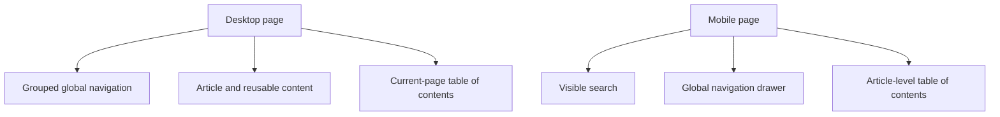
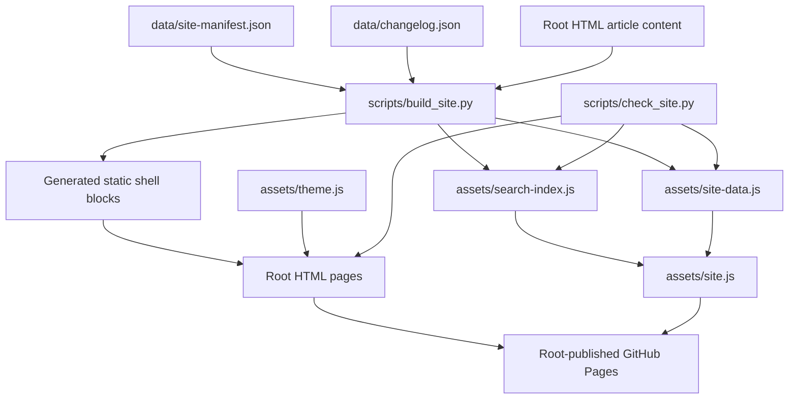
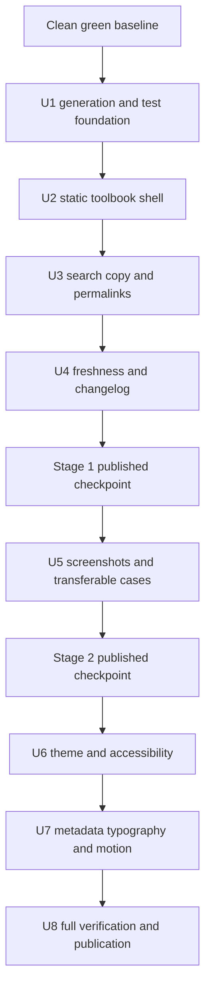

# Codex Desktop Guide Toolbook Upgrade - Plan

## Goal Capsule

- **Objective:** Turn the Chinese Codex Desktop guide into a searchable, actionable, citable, and maintainable toolbook through three independently accepted delivery stages.
- **Product authority:** The confirmed Product Contract in this document governs reader behavior, scope, and success signals; the public web guide remains the canonical product surface.
- **Authority hierarchy:** Current user instructions, this Product Contract, this Planning Contract, repository `AGENTS.md`, then observed local patterns.
- **Execution profile:** Deep, three-stage documentation-engineering delivery with generated static artifacts, characterization-first structural tests, and real-browser interaction checks.
- **Stop conditions:** Stop if work begins from an overlapping dirty baseline, if generation would overwrite authored article content, if screenshot redaction cannot be verified, or if a stage cannot restore every applicable verification gate.
- **Tail ownership:** The main execution thread owns integration, final local and published-site verification, and any authorized Git or release action.
- **Open handoff item:** Select the remaining Mermaid delivery trust policy before U7; representative-reader recruitment is an external stage-gate dependency, not an implementation substitute.

---

## Product Contract

### Summary

Upgrade the existing static guide around a shared toolbook shell, real Codex Desktop operating evidence, and a sustainable publication-quality contract.
Deliver the complete scope in three stages without migrating away from root-published GitHub Pages.

### Problem Frame

The guide already provides task paths, decision tables, prompt templates, counterexamples, and a coherent visual language.
Its current interaction model still favors linear reading over repeated lookup: readers cannot search the whole guide, copy prompts with one action, deep-link reliably to headings, or navigate every long page through a consistent table of contents.

The guide also teaches a visual desktop product without enough real interface evidence.
Most current examples describe maintaining the guide itself, which limits transfer to engineering and research work.
Readers cannot reliably distinguish a recently edited page from a recently re-verified Codex product fact.

The GLM review supplied the initial problem signals, not user-behavior proof.
No real-reader evidence is available yet, so each delivery stage must include a small task-based reader check rather than treating the model review as validation.

### Key Decisions

- **Complete scope, staged delivery.** Three stages reduce integration and review risk, but every confirmed review category remains in the final contract.
- **Toolbook shell over page-by-page patches.** Desktop pages use a stable three-column composition with global navigation on the left, content in the center, and the current-page table of contents on the right.
- **Adaptive mobile behavior.** Mobile keeps search visible, moves global navigation into a menu drawer, and exposes the current-page table of contents above the article.
- **Static publication remains authoritative.** The public site stays ordinary HTML, CSS, and JavaScript published from the repository root; generation and validation may assist maintenance without becoming a reader-facing runtime dependency.
- **Freshness has two meanings.** Each page separates its modification date from the date when volatile Codex facts were last verified.
- **Updates remain visible but bounded.** The homepage shows the three latest material updates after the primary path chooser and links to a complete chronological changelog.

### Actors

- A1. **First-time reader:** A Chinese-speaking student or developer who needs enough context and visual evidence to complete a first Codex Desktop task.
- A2. **Returning reader:** A reader who already knows the guide and needs to find a specific rule, section, or reusable prompt quickly.
- A3. **Guide maintainer:** The person updating pages, screenshots, product facts, navigation, and release notes while preserving publication and validation contracts.

### Requirements

**Stage 1: Toolbook foundations**

- R1. The public guide provides full-site search across page titles, headings, explanatory text, and reusable prompt content.
- R2. Search results identify the destination page and section, support keyboard operation, and take the reader to a stable deep link.
- R3. Every reusable code or prompt block offers a keyboard-accessible copy action with clear success and failure feedback.
- R4. Every reader-facing H2 and H3 has a stable identifier and a discoverable permalink without changing existing valid inbound fragments.
- R5. Desktop content pages use the confirmed three-column toolbook shell with grouped global navigation, a readable article column, and a current-page table of contents.
- R6. Mobile pages keep search visible, move global navigation into a menu drawer, and place the current-page table of contents above the article without horizontal page scrolling.
- R7. All content pages provide consistent location and sequence cues through breadcrumbs and previous/next navigation where a meaningful sequence exists.
- R8. Every public content page displays both its page modification date and its Codex fact verification date using unambiguous labels.
- R9. The homepage shows the three latest material updates after the primary path chooser and links to a complete chronological changelog.
- R10. Stage 1 applies the shared shell and interaction contract consistently across every public guide page rather than limiting it to selected long pages.



**Stage 2: Actionable beginner evidence**

- R11. The installation and Desktop workflow pages use real, current Codex Desktop screenshots to cover setup, repository opening, approval, review, and browser-feedback states.
- R12. Screenshots redact private data, include useful captions and alternative text, and identify the product surface or verification date needed to judge freshness.
- R13. At least half of the guide-maintenance examples are replaced or complemented by transferable cases covering a Python bug fix, an experiment-to-plot workflow, and a LaTeX paper task.
- R14. Transferable cases show the reader's starting state, prompt, approval boundary, observable result, failure recovery, and verification evidence.
- R15. Reader-facing labels follow a Chinese-first language rule while preserving exact product identifiers such as `Goal`, `Subagent`, `AGENTS.md`, `Skills`, and command names.

**Stage 3: Reading and publication quality**

- R16. The guide supports a dark presentation that respects the reader's system preference and offers a persistent manual choice.
- R17. Text, controls, focus indicators, diagrams, screenshots, and decorative marks meet the guide's declared accessibility baseline in both light and dark presentations.
- R18. External links communicate that they leave the guide and open safely without discarding the reader's current page state.
- R19. The published typography contract uses only fonts the browser can actually resolve, with a deliberate system-font fallback when a custom font is unavailable.
- R20. Shared social metadata produces a meaningful title, description, and preview image when guide links are shared.
- R21. Motion is optional, respects reduced-motion preferences, and never delays access to article content when animation libraries are unavailable.
- R22. Publication checks cover search data, copy controls, heading permalinks, navigation consistency, date labels, changelog linkage, screenshot metadata, accessibility markers, and local links.
- R23. Each stage preserves the existing verified reader contracts and finishes with a published-site check in addition to local validation.

### Key Flows

- F1. **Known-item lookup**
  - **Trigger:** A2 returns to find a remembered concept, decision matrix, or prompt.
  - **Actors:** A2
  - **Steps:** Search the guide, inspect section-aware results, open the stable fragment, then copy or share the relevant content.
  - **Outcome:** The reader reaches and reuses the target without scanning navigation labels page by page.
  - **Covered by:** R1-R4, R7
- F2. **First Desktop task**
  - **Trigger:** A1 enters through the beginner path with no reliable mental model of the Codex Desktop interface.
  - **Actors:** A1
  - **Steps:** Follow current screenshots, perform the bounded task, approve only explained actions, inspect the result, and use recovery guidance if the evidence does not match.
  - **Outcome:** The reader can complete and verify one task without inventing missing interface steps.
  - **Covered by:** R11-R15
- F3. **Material guide update**
  - **Trigger:** A3 changes reader-facing guidance, screenshots, or volatile Codex facts.
  - **Actors:** A3
  - **Steps:** Update the affected content, record the page modification date, re-verify relevant facts when applicable, add a changelog entry, run publication checks, and verify the published site.
  - **Outcome:** Readers can see what changed and whether product-specific guidance remains current.
  - **Covered by:** R8-R9, R12, R22-R23
- F4. **Responsive navigation**
  - **Trigger:** A reader opens the same content page on a narrow screen.
  - **Actors:** A1, A2
  - **Steps:** Use visible search, open grouped global navigation from the drawer when needed, and jump within the article from the collapsed page table of contents.
  - **Outcome:** The page retains toolbook wayfinding without horizontal scrolling or hidden search.
  - **Covered by:** R5-R7

### Acceptance Examples

- AE1. **Covers R1-R4.** Given a returning reader who searches for “审批决策矩阵,” when they choose the matching result, then the guide opens the permissions page at a stable section fragment and exposes a shareable permalink.
- AE2. **Covers R3.** Given a prompt block, when the reader activates its copy control using a keyboard, then the complete prompt reaches the clipboard and the control announces the outcome without changing page position.
- AE3. **Covers R5-R7.** Given the Goal page on desktop, when the reader scrolls the article, then grouped global navigation and the page table of contents remain usable while the article stays readable.
- AE4. **Covers R6.** Given the same page on mobile, when the reader opens global navigation or the page table of contents, then each appears through its adaptive control and the document does not require horizontal scrolling.
- AE5. **Covers R8-R9.** Given a material content update, when the updated site is published, then the affected page shows the correct modification and verification dates while the homepage and complete changelog describe the change.
- AE6. **Covers R11-R14.** Given a first-time reader following the Desktop workflow, when the interface reaches an approval or review state, then the guide shows a matching real screenshot and explains the action, risk boundary, and evidence to inspect.
- AE7. **Covers R16-R17, R21.** Given dark system preference, manual theme override, reduced-motion preference, or failed animation loading, when a page opens, then content remains immediately readable and all controls retain visible focus and sufficient contrast.
- AE8. **Covers R22-R23.** Given any stage's candidate release, when validation runs, then structural regressions fail locally and the same reader contract is checked again on the published GitHub Pages site.

### Success Criteria

- Stage 1: In a small test with at least three representative readers, the median known-item lookup completes within 30 seconds and reusable prompts can be copied without text selection.
- Stage 1: Desktop and mobile checks find no inconsistent global navigation sets, broken heading fragments, or horizontal page overflow.
- Stage 2: At least two of three first-time readers complete a bounded Desktop task and identify its verification evidence without facilitator-provided interface instructions.
- Stage 2: Installation and Desktop workflow coverage includes at least five real screenshots across the critical states named in R11.
- Stage 3: Automated and manual review pass the declared accessibility, theme, metadata, reduced-motion, link, and publication contracts on representative desktop and mobile viewports.
- Final: A returning reader can determine what changed, when a page changed, and when volatile Codex facts were last verified without consulting repository history.

### Scope Boundaries

- Do not migrate the public guide to a documentation framework or require a reader-facing application runtime.
- Do not add accounts, behavioral analytics, a backend search service, or a reader data store.
- Do not turn the Chinese-first guide into a full bilingual site; preserve English only where product identifiers and commands require it.
- Do not treat decorative illustrations as substitutes for real Codex Desktop operating evidence.
- Do not keep expanding the page count as a proxy for quality; add only the complete changelog or another information surface required by this contract.
- Do not publish internal task records under `doc/` as reader-facing content.

### Dependencies and Assumptions

- The public web guide remains the canonical artifact and GitHub Pages continues to publish the repository-root static files.
- The GLM review is a heuristic source. Real-reader tests introduced by this contract provide the first behavioral evidence.
- Product screenshots can become stale faster than general workflow guidance and therefore require explicit verification ownership.
- Existing local changes and validation failures may overlap adjacent guide work; planning must establish a clean baseline before attributing failures to this upgrade.

### Sources and Research

- User-provided GLM guide review dated 2026-07-11.
- `docs/ideation/2026-07-10-codex-desktop-guide-effectiveness-ideation.html` for the prior task-evidence and maintenance framing.
- `AGENTS.md`, `README.md`, and `CONTEXT.md` for the current product, publication, and vocabulary boundaries.
- `assets/site.css`, `assets/site.js`, and `scripts/check_site.py` for the current shared presentation, behavior, and validation surface.

---

## Planning Contract

### Product Contract Preservation

Product requirements, flows, R/A/F/AE IDs, and success criteria are unchanged and remain authoritative. The questions previously deferred from product discovery are resolved by the decisions and implementation units below.

### Sources and Research

- MDN `Clipboard.writeText()` documentation for secure-context, Promise, and `NotAllowedError` behavior: https://developer.mozilla.org/en-US/docs/Web/API/Clipboard/writeText
- MDN `prefers-color-scheme` documentation for system light/dark preference detection: https://developer.mozilla.org/en-US/docs/Web/CSS/@media/prefers-color-scheme
- WAI-ARIA Authoring Practices modal dialog pattern for inert background, contained tab order, Escape handling, and focus restoration: https://www.w3.org/WAI/ARIA/apg/patterns/dialog-modal/
- WCAG 2.2 success criteria for contrast, non-text contrast, focus visibility, focus appearance, and target size: https://www.w3.org/TR/WCAG22/
- Playwright web-server documentation for a reproducible local static-server lifecycle and base URL: https://playwright.dev/docs/test-webserver

### Repository Grounding

- The site has 19 root HTML pages, no application framework, no runtime backend, and no dependency manifest.
- All public pages share `assets/site.css` and `assets/site.js`; interactive libraries are currently loaded from CDNs.
- Navigation currently exists in two inconsistent sets of 12 and 17 links.
- Nine pages have a `.side-nav`; task pages generally do not.
- `scripts/check_site.py` and `tests/test_check_site.py` provide the established stdlib-Python validation pattern.
- `docs/solutions/` contains no prior implementation learning for this feature area.
- Official implementation references confirm that Clipboard writes can fail outside secure contexts, modal dialogs must contain focus and restore it on close, WCAG 2.2 defines measurable contrast/focus/target baselines, and Playwright can own a local web-server lifecycle for browser tests.

### Key Technical Decisions

- **KTD1. Generated static shell with checked-in outputs.** Add a deterministic Python generator that owns bounded shared blocks and derived assets while leaving authored article content in the root HTML files.
- **KTD2. Central manifest for global structure and freshness.** A machine-readable site manifest owns page grouping, order, labels, page modification dates, and fact verification dates; a separate changelog source owns material release entries.
- **KTD3. Progressive enhancement, not runtime composition.** Global navigation, breadcrumbs, page TOC, freshness labels, and previous/next links are present in published HTML. JavaScript adds search, copy feedback, drawers, theme control, and active-section behavior, with explicit fallback because Clipboard writes require a secure context and can raise `NotAllowedError`.
- **KTD4. Author-owned stable anchors.** H2/H3 IDs remain explicit authored contracts. The generator and checker reject missing or duplicate IDs but never silently rename an existing fragment.
- **KTD5. Section-level static search.** Build a compact search record per page section from visible article text and prompt blocks, excluding shared chrome. Publish the index as a local JavaScript asset so search works on GitHub Pages and when HTML files are opened locally.
- **KTD6. Freshness is explicit metadata.** Modification and fact-verification dates come from the site manifest rather than Git timestamps, because a formatting commit does not prove product facts were rechecked.
- **KTD7. Dark presentation initializes before paint.** A small head-loaded theme initializer applies the saved user choice or the system preference exposed by `prefers-color-scheme` before the shared stylesheet renders; the footer script owns the visible toggle and later changes.
- **KTD8. Real-browser regression is a development dependency only.** Add a small Playwright suite because the confirmed behaviors depend on focus, viewport, storage, Clipboard failure, and script loading rather than markup alone. Playwright's configured web-server lifecycle keeps this test repeatable without changing the published runtime or converting the repository into a front-end application.
- **KTD9. Stage gates protect the current guide contract.** Each delivery stage lands only after generated assets are current, Python checks pass, browser scenarios pass, and the published checkpoint satisfies the stage-specific reader contract.

### High-Level Technical Design

The generator converts small, reviewable sources into committed static output. Generated blocks use explicit sentinels so the script can replace only shared chrome and never infer article boundaries from fragile text matching.



The delivery sequence preserves an independently useful result after every stage.



### Output Structure

```text
data/
  site-manifest.json
  changelog.json
assets/
  site-data.js
  search-index.js
  theme.js
scripts/
  site_model.py
  build_site.py
  check_published_site.py
tests/
  test_build_site.py
  test_published_site.py
  browser/
    toolbook.spec.js
```

Existing root HTML pages, `assets/site.css`, `assets/site.js`, `scripts/check_site.py`, and `tests/test_check_site.py` remain part of the implementation surface.

### Sequencing and Integration Constraints

- Begin only after the adjacent evidence-loop work is landed or isolated in a clean worktree where the existing `make check` baseline is green.
- U1 establishes generated-block sentinels and stale-output checks before any shared page migration.
- U2 through U4 complete Stage 1 and must publish as one coherent toolbook-shell checkpoint.
- U5 begins only after the shared figure, caption, date, and accessibility contracts exist.
- U6 and U7 may be implemented separately but integrate sequentially because both touch shared CSS, head metadata, and JavaScript initialization.
- U8 owns cross-stage regression, README/ADR maintenance, and public-site evidence; earlier units verify only their bounded contracts.

### Alternative Approaches Considered

- **Continue hand-editing every page:** Rejected because the existing 12-link and 17-link navigation variants demonstrate structural drift, and the new dates, TOCs, metadata, and changelog would multiply that drift surface.
- **Migrate to a documentation framework:** Rejected by the Product Contract because it would replace the root-published static model and turn a guide-quality project into a framework migration.
- **Inject the whole shell at runtime:** Rejected because navigation, breadcrumbs, freshness labels, and deep-link structure should remain present in static HTML when enhancement JavaScript fails.
- **Adopt a hosted search service:** Rejected because the corpus is small, the guide must remain self-contained, and a backend or external indexing dependency adds carrying cost without reader value.

### System-Wide Impact

- **All public pages:** Shared chrome, headings, metadata, navigation order, and generated markers become site-wide contracts.
- **Maintainer workflow:** Content changes that affect search, page dates, fact verification, or release notes require regeneration before validation.
- **Published assets:** Search, theme, screenshots, and social preview files become release-critical rather than decorative.
- **Local development:** Python remains the generation and static-check foundation; Node and Playwright are added only for browser regression.
- **Reader privacy:** Screenshots and changelog entries must not expose local paths, account identifiers, repository secrets, private task text, or personal notifications.

### Risks and Mitigations

| Risk | Impact | Mitigation |
|---|---|---|
| Generator rewrites authored content | Large, hard-to-review diffs or content loss | Replace only sentinel-delimited blocks; add idempotence and preservation tests before migration |
| Search index becomes stale | Readers receive missing or wrong results | Commit deterministic index output and make stale-output detection part of `make check` |
| Stable links break during heading migration | External and internal fragments fail | Preserve all existing IDs, add new unique heading IDs, and validate every fragment before each checkpoint |
| Screenshot content leaks private data | Privacy breach in a public repository | Use a capture checklist, crop/redact before commit, and require independent visual inspection |
| Clipboard API is denied or unavailable | Copy controls appear successful while copying nothing | Treat Clipboard as a fallible secure-context API, announce failure, preserve selectable prompt text, and test denied/local-file cases |
| Dark mode or animation hides content | Accessibility regression | Initialize theme before paint, preserve readable defaults, and test reduced-motion and script-failure cases |
| Search or navigation modal mishandles focus | Keyboard and assistive-technology users become trapped or lose their place | Keep focus inside a true modal, support Escape and a visible close control, make background content inert, and return focus to the trigger |
| Browser tooling burdens contributors | The verification contract becomes impractical | Keep static checks as the fast default gate and isolate browser installation and execution in a documented target |
| CDN behavior changes | Mermaid or legacy animations fail unexpectedly | Keep core navigation and content independent of CDN success; remove nonessential GSAP dependence |
| Adjacent dirty work overlaps root pages | Accidental loss or mixed commits | Start from a clean isolated baseline and do not reconcile unrelated residue inside this plan |

### Review-Gated Handoff Item

- **Mermaid delivery trust policy:** Before U7, choose between the recommended self-hosted, version-pinned Mermaid browser asset (including its license notice) and a version-pinned CDN asset protected by integrity metadata and `crossorigin`. The implementation must reject unpinned executable CDN scripts either way.
- **External reader dependency:** The Stage 1 and Stage 2 thresholds require at least three representative readers. Recruitment and consent are supplied outside the repository; if readers are unavailable, the applicable stage remains unreleased unless the Product Contract is explicitly amended.

### Deferred Implementation Notes

- Exact search weighting and highlight thresholds may be tuned against the built corpus after deterministic baseline cases pass.
- Exact responsive breakpoints may adjust during browser verification without changing the confirmed desktop and mobile behavior.
- Screenshot cropping and annotation style may adapt to the current Codex App surface as long as the required states, redaction, and freshness evidence remain intact.
- The currently supported Playwright version must be selected during U1; the plan relies on stable official behavior rather than pinning a version before installation.

---

## Implementation Units

### U1. Static generation and browser-test foundation

**Goal:** Establish one deterministic source for page structure, freshness, changelog data, generated search assets, and reproducible browser verification.

**Requirements:** R8-R10, R22-R23; supports F3 and AE5, AE8.

**Dependencies:** Clean green repository baseline after adjacent work is landed or isolated.

**Files:**

- Create `data/site-manifest.json`
- Create `data/changelog.json`
- Create `scripts/site_model.py`
- Create `scripts/build_site.py`
- Create `tests/test_build_site.py`
- Create `scripts/check_published_site.py`
- Create `tests/test_published_site.py`
- Create `package.json`
- Create `package-lock.json`
- Create `playwright.config.js`
- Create `tests/browser/toolbook.spec.js`
- Modify `Makefile`
- Modify `scripts/check_site.py`
- Modify `tests/test_check_site.py`

**Approach:** Define explicit schemas for page order, navigation groups, modification dates, fact-verification dates, and changelog entries. Implement sentinel-bounded generation with write and check-only modes. Add a fast static gate and a separate real-browser gate so ordinary content checks do not require a browser installation.

**Execution note:** Add characterization tests for the current 19-page parse and validation behavior before extending the parser or generator.

**Patterns to follow:** Reuse the stdlib `HTMLParser`, `Path`, `unittest`, explicit error aggregation, and `Makefile` entry patterns in `scripts/check_site.py` and `tests/test_check_site.py`.

**Test scenarios:**

1. A complete manifest covering all 19 root pages produces deterministic output on two consecutive runs.
2. Check-only mode reports a missing page, duplicate order, invalid date, unknown navigation group, or changelog entry without a valid target.
3. Generated-block replacement changes only sentinel-delimited regions and preserves article bytes outside those regions.
4. A manually changed generated asset causes stale-output validation to fail with the affected path.
5. Browser-test setup serves the root static pages without requiring a production build or backend.
6. The published-site checker can validate a supplied base URL without mutating the deployment and has fixture-backed tests for stale HTML, missing assets, and broken critical fragments.

**Verification:** Generation is idempotent, stale artifacts are detectable, the existing semantic checker behavior remains covered, and static versus browser gates can run independently.

### U2. Static three-column toolbook shell

**Goal:** Normalize all public pages into the confirmed desktop shell and adaptive mobile navigation while preserving existing fragments and article content.

**Requirements:** R4-R7, R10; covers A1-A2, F4, AE3-AE4.

**Dependencies:** U1.

**Files:**

- Modify `data/site-manifest.json`
- Modify `scripts/build_site.py`
- Modify `scripts/check_site.py`
- Modify `tests/test_build_site.py`
- Modify `tests/test_check_site.py`
- Modify `assets/site.css`
- Modify `assets/site.js`
- Modify all root `*.html` pages
- Modify `tests/browser/toolbook.spec.js`

**Approach:** Generate grouped global navigation, breadcrumbs, current-page TOCs, freshness slots, and previous/next links as static HTML. During the one-time shell migration, assign deterministic explicit IDs to reader-facing H2/H3 elements that lack them, preserve every existing valid section ID, and use JavaScript only for drawer state, active-section indication, and focus restoration.

**Execution note:** Migrate one concept page, one task page, and the homepage first; use them as characterization fixtures before applying the shell to the remaining pages.

**Patterns to follow:** Preserve `.topbar`, `.nav`, `.doc-layout`, `.side-nav`, `.doc-content`, and responsive CSS concepts where they remain useful; evolve their roles instead of introducing a parallel component vocabulary.

**Test scenarios:**

1. Covers F4 / AE4. At a narrow viewport, search stays visible, the global menu opens and closes with keyboard input, focus returns to its trigger, the page TOC appears above the article, and no horizontal document overflow occurs.
2. Covers AE3. At a desktop viewport, global navigation, article content, and page TOC form three usable columns without reducing the article below its readable width.
3. Every root page contains the same grouped global navigation contract and identifies the current page once.
4. Existing fragments such as `permissions.html#matrix` and current cross-page evidence-loop links still resolve after migration.
5. Pages with no meaningful sequence omit misleading previous/next links while sequenced pages expose both valid destinations.
6. With interaction JavaScript disabled, static navigation, breadcrumbs, TOC links, dates, and article content remain usable.

**Verification:** All 19 pages pass structural checks at representative desktop and mobile widths, existing inbound anchors remain valid, and generated shell output is current.

### U3. Full-site search, copy controls, and heading permalinks

**Goal:** Make known-item lookup, prompt reuse, and section sharing fast across the complete guide.

**Requirements:** R1-R4, R22; covers F1 and AE1-AE2.

**Dependencies:** U1, U2.

**Files:**

- Create generated `assets/search-index.js`
- Modify `scripts/site_model.py`
- Modify `scripts/build_site.py`
- Modify `tests/test_build_site.py`
- Modify `scripts/check_site.py`
- Modify `tests/test_check_site.py`
- Modify `assets/site.css`
- Modify `assets/site.js`
- Modify all root `*.html` pages for permalink affordances around the stable IDs established in U2
- Modify `tests/browser/toolbook.spec.js`

**Approach:** Index one record per meaningful heading with page title, section title, stable fragment, normalized visible text, and prompt text. Exclude global chrome and decorative content. Use a local, dependency-free search UI with keyboard traversal, section-aware results, loading/index-unavailable/empty/no-result states, and a direct deep-link target. Add copy controls progressively to reusable `pre > code` blocks and expose heading permalinks without changing the stable IDs established in U2.

**Test scenarios:**

1. Covers AE1. Searching `审批决策矩阵` returns the permissions section and opens its stable fragment.
2. Chinese phrases, English identifiers such as `AGENTS.md`, mixed-case queries, surrounding whitespace, and punctuation normalize predictably.
3. Empty queries show guidance, unmatched queries show a no-result state, and repeated terms do not produce duplicate section results.
4. Navigation, footer, and repeated shared labels do not pollute search ranking.
5. Covers AE2. Keyboard activation copies the complete prompt, announces success, preserves scroll position, and reports a non-destructive failure when Clipboard access is unavailable.
6. Every H2/H3 has a unique ID and discoverable permalink; existing section fragments continue to work.
7. Search remains operable when pages are opened from local static files as well as the local HTTP test server.

**Verification:** The deterministic index matches the current corpus, target lookup scenarios pass in a real browser, all copyable blocks have accessible controls, and every reader-facing heading is shareable.

### U4. Freshness metadata and public changelog

**Goal:** Give readers an accurate view of page changes, product-fact verification, and material guide updates.

**Requirements:** R8-R9, R22-R23; covers A2-A3, F3, AE5.

**Dependencies:** U1-U3.

**Files:**

- Modify `data/site-manifest.json`
- Modify `data/changelog.json`
- Modify `scripts/build_site.py`
- Modify `scripts/check_site.py`
- Modify `tests/test_build_site.py`
- Modify `tests/test_check_site.py`
- Create generated `assets/site-data.js`
- Create `changelog.html`
- Modify `index.html`
- Modify all root content `*.html` pages
- Modify `assets/site.css`
- Modify `assets/site.js`
- Modify `tests/browser/toolbook.spec.js`

**Approach:** Render separate Chinese labels for modification and fact verification dates. Generate the homepage's three-entry summary after the primary path chooser and a complete chronological changelog page from the same source. Define material-update categories so routine generated-output refreshes do not create misleading reader-facing entries.

**Test scenarios:**

1. Covers AE5. A material entry appears in chronological order on `changelog.html`, and the latest three entries appear on the homepage with valid targets.
2. A page can update its modification date without changing its fact-verification date.
3. A fact re-verification can advance independently while preserving the prior changelog history.
4. Invalid chronology, duplicate release identifiers, missing summaries, or changelog links to absent fragments fail validation.
5. Pages with stable principles still show explicit dates without implying every fact changes on every edit.

**Verification:** Every public content page exposes both date meanings, the homepage summary and full log share one source, and stale or inconsistent metadata fails the fast check.

### U5. Real Desktop evidence and transferable examples

**Goal:** Replace interface guesswork and guide-maintenance circularity with redacted screenshots and cases that transfer to real engineering and research work.

**Requirements:** R11-R15; covers A1, F2, AE6 and Stage 2 success criteria.

**Dependencies:** U4 and access to a current Codex Desktop surface suitable for public capture.

**Files:**

- Create `figures/desktop-install-entry.png`
- Create `figures/desktop-open-repository.png`
- Create `figures/desktop-approval-request.png`
- Create `figures/desktop-diff-review.png`
- Create `figures/desktop-browser-feedback.png`
- Modify `install-desktop.html`
- Modify `desktop-cli.html`
- Modify `codex.html`
- Modify `permissions.html`
- Modify `daily-workflow.html`
- Modify `automation.html`
- Modify `mcp.html`
- Modify `resources.html`
- Modify `research.html` only where needed to align the experiment-to-plot case contract
- Modify `scripts/check_site.py`
- Modify `tests/test_check_site.py`
- Modify `tests/browser/toolbook.spec.js`

**Approach:** Capture at least five current interface states with private data removed before commit. Pair each screenshot with a caption, alt text, surface/version context, and the action or evidence the reader should inspect. Replace or complement self-referential examples across the named pages with a Python bug fix, experiment-to-plot workflow, LaTeX paper task, and transferable permission/MCP/resource cases while retaining evidence-backed historical collaboration cases from adjacent work.

**Execution note:** Treat screenshots as public data artifacts: inspect the final pixels, not only source-window intent, before accepting them.

**Patterns to follow:** Reuse `.figure-card`, explicit case labels, six-part task evidence, and the historical/composite/demo distinctions already enforced by `scripts/check_site.py`.

**Test scenarios:**

1. Covers AE6. Each required Desktop state has a matching screenshot, nearby action explanation, approval boundary, and observable verification evidence.
2. Every screenshot has non-empty alt text, intrinsic dimensions, a caption, and a freshness reference.
3. A repository scan finds none of the prohibited private identifiers defined by the capture checklist in filenames, alt text, captions, or adjacent prompts.
4. At least half of the formerly guide-maintenance examples are replaced or complemented, and the three required transferable scenario families remain present.
5. The first-task flow remains coherent when read from installation through review without relying on screenshots alone.
6. Desktop and mobile rendering preserve screenshot legibility without overflow or unreadable downscaling.

**Verification:** Stage 2 content and image checks pass, an independent visual inspection confirms redaction, and the bounded first-reader task script can be run without inventing interface steps.

### U6. Theme, accessibility, and resilient interaction

**Goal:** Make the toolbook readable and operable across light/dark preferences, keyboard use, assistive technology, reduced motion, and JavaScript failure.

**Requirements:** R16-R18, R21-R22; covers AE7.

**Dependencies:** U2-U5 and the primary Clipboard, ARIA, and WCAG contracts recorded in Sources and Research.

**Files:**

- Create `assets/theme.js`
- Modify `assets/site.css`
- Modify `assets/site.js`
- Modify `scripts/build_site.py`
- Modify `scripts/check_site.py`
- Modify `tests/test_build_site.py`
- Modify `tests/test_check_site.py`
- Modify all root `*.html` pages
- Modify `tests/browser/toolbook.spec.js`

**Approach:** Extend existing CSS variables into paired light and dark tokens, apply the saved/system theme before paint, and expose a labeled three-state System/Light/Dark control so a reader can remove a saved override and return to system behavior. Use native disclosure semantics for navigation and a true modal only where background interaction is intentionally blocked. A modal must contain its tab sequence, close on Escape, expose a visible close control, make the background inert, and return focus to its trigger. Enforce WCAG 2.2 AA baselines of 4.5:1 for normal text and 3:1 for component boundaries and focus indicators, with 24 by 24 CSS pixel pointer targets unless a documented exception applies. Remove GSAP from the critical reading path and delete it if the remaining motion does not justify the dependency.

**Test scenarios:**

1. Covers AE7. System light, system dark, persisted manual light, and persisted manual dark resolve in the correct precedence without a readable-theme flash.
2. Theme controls, menu drawer, search results, copy buttons, and heading permalinks are reachable and operable in a logical keyboard order.
3. Escape closes transient surfaces, focus returns to the trigger, and background content is not accidentally interactive while a modal surface is active.
4. Reduced-motion preference removes nonessential transitions and leaves all content immediately visible.
5. Failed GSAP, Mermaid, search-index, Clipboard, or local-storage access does not hide article content or remove static navigation.
6. Light and dark tokens meet the chosen contrast baseline for normal text, muted text, controls, and focus indicators.
7. External links identify their behavior, use safe relation attributes, and do not apply new-tab behavior to local navigation.

**Verification:** Primary-guidance references are recorded, keyboard and reduced-motion browser scenarios pass, static HTML remains usable without enhancement, and representative light/dark pages pass contrast and focus review.

### U7. Typography, social metadata, and nonessential dependency cleanup

**Goal:** Finish the publication surface with truthful fonts, consistent page metadata, meaningful share previews, and a smaller noncritical runtime.

**Requirements:** R19-R22.

**Dependencies:** U4, U6.

**Files:**

- Create `figures/social-preview.png`
- Modify `data/site-manifest.json`
- Modify `scripts/build_site.py`
- Modify `scripts/check_site.py`
- Modify `tests/test_build_site.py`
- Modify `tests/test_check_site.py`
- Modify `assets/site.css`
- Modify `assets/site.js`
- Modify all root `*.html` pages
- Modify `tests/browser/toolbook.spec.js`

**Approach:** Remove the unresolved Geist claim unless a local, licensed font asset is deliberately shipped. Generate per-page description, canonical URL, Open Graph, and Twitter metadata from the page manifest with one shared preview image. Audit CDN scripts so Mermaid remains scoped to pages that need it and nonessential animation libraries are removed or deferred.

**Test scenarios:**

1. Every root page has a unique non-empty title and description plus canonical, Open Graph, and Twitter metadata.
2. Social preview URLs and dimensions resolve to the checked-in preview image under the GitHub Pages base path.
3. Typography renders from declared available families and retains a stable CJK-capable fallback.
4. Pages without Mermaid markup do not load Mermaid; removed animation dependencies leave no dead initialization paths.
5. Metadata generation remains correct for both the homepage URL and nested page URLs.

**Verification:** Metadata and asset checks pass for all public pages, link-preview data is complete, font declarations match shipped or system-resolvable assets, and unnecessary CDN requests are absent.

### U8. Release gates, reader checks, and maintainer documentation

**Goal:** Close all three stages with reproducible local, browser, reader, and published-site evidence while documenting the new maintenance contract.

**Requirements:** R22-R23 and all Product Contract success criteria; covers F1-F4 and AE1-AE8.

**Dependencies:** U1-U7.

**Files:**

- Modify `scripts/check_published_site.py`
- Modify `tests/test_published_site.py`
- Modify `Makefile`
- Modify `README.md`
- Modify `AGENTS.md`
- Modify `CONTEXT.md`
- Create `docs/adr/0002-generated-toolbook-shell.md`
- Modify `scripts/check_site.py`
- Modify `tests/test_check_site.py`
- Modify `tests/browser/toolbook.spec.js`

**Approach:** Define separate fast-static, browser, reader-task, and published-site gates. Document the source/edit/generate/check/publish lifecycle, freshness ownership, screenshot replacement rules, and stage checkpoints. Keep reader-test observations outside the public site unless the user later authorizes publication of aggregated evidence.

**Execution note:** Run the complete contract from a clean checkout before the final public check so untracked generated assets or local caches cannot mask missing repository inputs.

**Patterns to follow:** Extend the existing `make check` and public GitHub Pages verification language in `AGENTS.md` and `README.md`; record the generator boundary as a durable ADR rather than burying it in commands.

**Test scenarios:**

1. Covers AE8. A clean checkout can regenerate identical outputs and pass the fast static and real-browser gates.
2. The published-site checker detects stale deployment, missing assets, broken critical fragments, absent update metadata, or wrong homepage changelog entries.
3. Stage 1 reader scripts measure known-item lookup and copy reuse; Stage 2 scripts measure first-task completion and evidence identification.
4. Published checks cover representative desktop/mobile pages and all newly added asset classes without mutating external state.
5. Maintainer instructions name every source-of-truth file and do not tell contributors to hand-edit generated blocks.

**Verification:** The complete verification matrix passes from a clean checkout, reader observations meet or explicitly report against the Product Contract thresholds, and the public GitHub Pages checkpoint exposes the expected content and assets.

---

## Verification Contract

| Gate | Command or method | Applies to | Required outcome |
|---|---|---|---|
| Generated artifact check | `python3 scripts/build_site.py --check` | U1-U8 | No missing, stale, or nondeterministic generated blocks/assets |
| Python unit suite | `python3 -m unittest discover -s tests` | U1-U8 | All generator, parser, semantic, metadata, and published-check fixtures pass |
| Static site contract | `python3 scripts/check_site.py` | U1-U8 | All root pages, local assets, fragments, navigation, dates, screenshots, and metadata satisfy the current contract |
| Fast aggregate gate | `make check` | Every implementation unit | Generation check plus Python/static validation passes without browser installation |
| Browser regression | `npm run test:browser` | U2-U7 | Search, copy, drawers, theme, keyboard, reduced motion, and desktop/mobile scenarios pass |
| Reader task check | Facilitated script with at least three representative readers | Stage 1 and Stage 2 checkpoints | Lookup and first-task thresholds in Success Criteria are measured and met or reported as an explicit release blocker |
| Published-site check | `python3 scripts/check_published_site.py --base-url https://whojay0609.github.io/codex-usage-guide/` | Each stage checkpoint | Public HTML and assets match the committed stage contract after deployment |
| Visual privacy review | Independent inspection of committed screenshots at original resolution | U5 and final | No private identifiers, secrets, local paths, or unintended task content remain visible |

### Traceability Matrix

| Product coverage | Implementation units | Primary gates |
|---|---|---|
| R1-R4, F1, AE1-AE2 | U1-U3 | Generated artifact, Python, static, browser |
| R5-R7, F4, AE3-AE4 | U1-U2 | Static, browser, responsive visual review |
| R8-R10, F3, AE5 | U1, U4 | Generated artifact, Python, static, published site |
| R11-R15, F2, AE6 | U5 | Static, browser, reader task, privacy review |
| R16-R18, R21, AE7 | U6 | Static, browser, accessibility review |
| R19-R20 | U7 | Static, browser, share-preview inspection |
| R22-R23, AE8 | U1-U8 | Complete verification matrix |

---

## Definition of Done

### Global Completion

- The artifact remains one coherent implementation-ready plan with an unchanged Product Contract and traceable R/A/F/AE coverage.
- All eight implementation units meet their verification outcomes in dependency order.
- Each of the three stages reaches its independent reader-facing checkpoint before later-stage work is counted as complete.
- Generated blocks and assets are deterministic, committed, current, and reproducible from documented sources.
- The complete local static and browser suites pass from a clean checkout.
- Reader-task thresholds are measured with at least three representative readers and satisfy the Product Contract or block release with recorded evidence.
- Public GitHub Pages checks confirm the deployed stage matches the committed guide.
- Screenshots pass redaction and accessibility review at original resolution.
- No abandoned generator path, unused search experiment, dead theme code, obsolete CDN include, or temporary screenshot remains in the final diff.
- Internal `doc/` process records, browser caches, reports, and private reader observations remain outside the public artifact.

### Per-Unit Completion

| Unit | Done signal |
|---|---|
| U1 | Deterministic generation, stale-output detection, and separate static/browser test entry points are established without altering authored content |
| U2 | Every public page uses the static three-column/adaptive shell and preserves existing fragment contracts |
| U3 | Search, copy, and heading permalink scenarios pass for Chinese, English, failure, keyboard, local-file, and HTTP cases |
| U4 | Dual freshness dates, homepage recent updates, and the full changelog share one validated source |
| U5 | Required redacted screenshots and transferable cases satisfy the Stage 2 reader contract |
| U6 | Theme, keyboard, focus, reduced-motion, failure fallback, contrast, and external-link behavior pass review |
| U7 | Fonts, per-page metadata, social preview, and nonessential script cleanup satisfy publication checks |
| U8 | Maintainer docs, ADR, reader checks, clean-checkout validation, and published-site evidence close the full plan |
