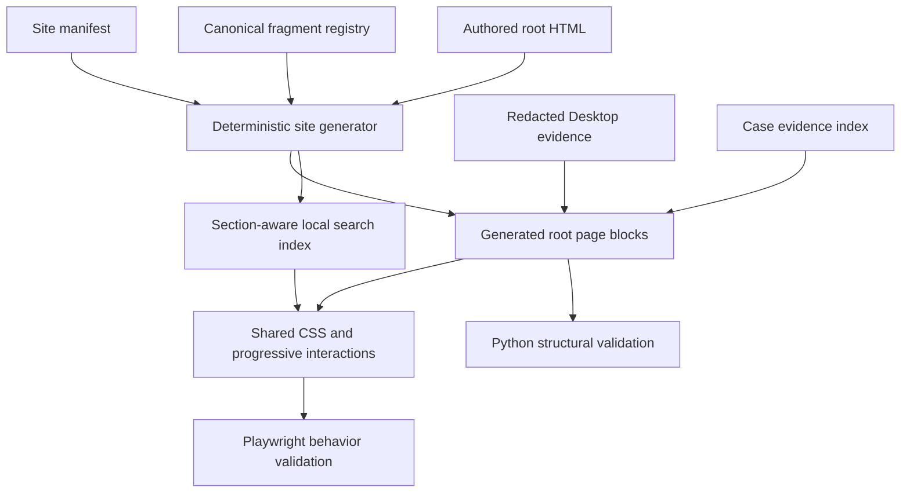

# Codex Guide Remaining Experience Gaps - Plan

## Goal Capsule

- **Objective:** Close the remaining retrieval, reuse, visual-evidence, theme, sharing, and publication-quality gaps in the Codex Desktop guide without reworking the accepted information architecture.
- **Product authority:** This contract governs the unfinished reader-facing scope confirmed after the follow-up review; the existing toolbook plan remains useful technical context where it does not conflict with this delta contract.
- **Authority hierarchy:** Current user instructions, this Product Contract, this Planning Contract, repository `AGENTS.md`, then observed local patterns.
- **Execution profile:** Deep, six-unit static-site enhancement delivered through deterministic generation, characterization-first structural tests, and real-browser interaction checks.
- **Stop conditions:** Stop rather than fabricate evidence if current Codex Desktop screenshots cannot be captured and redacted safely, if generated output would overwrite authored article content, or if existing valid fragments cannot be kept compatible.
- **Tail ownership:** LFG owns implementation, local verification, review, commit, PR, and CI; human reader observations and post-deployment public verification remain external release gates where unavailable in the branch workflow.

---

## Product Contract

### Summary

Complete the guide as a reusable learning tool in three deliveries: retrieval and reuse first, operating evidence second, and reading and publication quality third.
Preserve the accepted navigation shell while making recurring lookup, copying, sharing, and following Desktop procedures materially easier.

### Problem Frame

The guide's grouped navigation, mobile menu, breadcrumbs, page table of contents, previous and next links, freshness labels, and heading targets have improved first-pass reading.
Returning readers still cannot search the guide or copy reusable prompts with one action, and current heading links are neither discoverable nor durable under section reordering.

The installation and Desktop workflow pages teach a visual application without real product screenshots.
Most practical examples still describe maintaining the guide itself, so readers receive limited evidence that the workflow transfers to engineering and research tasks.

Reading and sharing quality also remain incomplete.
The guide has no site-wide dark presentation, external links discard the current reading context, shared links lack useful previews, typography names an unavailable font, and decorative motion remains a universal dependency.

### Key Decisions

- **Treat this as a remaining-scope contract.** Accepted navigation and information-architecture work is a regression baseline, not new delivery scope.
- **Deliver value in three stages.** Retrieval and reuse precede screenshots and transferable cases; theme, sharing, typography, and motion quality follow without blocking the first two stages.
- **Preserve inbound links while improving future stability.** Reader-facing headings receive semantic stable fragments, while already valid fragments continue to resolve.
- **Measure screenshot completeness by task-state coverage.** Installation and Desktop evidence must cover the critical setup, repository-opening, approval, review, and browser-feedback states rather than satisfy an arbitrary image count.
- **Keep implementation choices out of the product contract.** Libraries, code size estimates, and dependency choices are planning decisions so long as the published guide remains static and reader data stays local.

### Actors

- A1. **First-time reader:** A Chinese-speaking student or developer following the installation or Desktop workflow without an established interface mental model.
- A2. **Returning reader:** A reader locating a remembered rule, decision matrix, command, or reusable prompt.
- A3. **Guide maintainer:** The person updating content, screenshots, anchors, presentation, and publication metadata without breaking accepted reader contracts.

### Requirements

**Stage 1: Retrieval, reuse, and durable citation**

- R1. The public guide provides full-site search across page titles, headings, explanatory text, and reusable prompt content, with keyboard operation and section-aware results.
- R2. Search results take readers to stable section fragments and identify enough page and section context to distinguish similar matches.
- R3. Every reusable code or prompt block provides a keyboard-accessible copy action with clear success and failure feedback that does not move the reader away from the block.
- R4. Every reader-facing H2 and H3 exposes a discoverable permalink that readers can copy or share directly.
- R5. Heading fragments remain stable when unrelated sections are added, removed, or reordered, and existing valid inbound fragments continue to resolve.

**Stage 2: Operating evidence and transferable learning**

- R6. The installation and Desktop workflow pages use real, current Codex Desktop screenshots to cover setup, repository opening, approval, review, and browser-feedback states.
- R7. Every product screenshot protects private data and includes a useful caption, alternative text, and a product verification date or equivalent freshness signal.
- R8. At least half of the guide-maintenance examples are replaced or complemented by transferable engineering and research cases.
- R9. Transferable cases show the starting state, reusable prompt, approval boundary, observable result, failure recovery, and verification evidence.

**Stage 3: Reading and publication quality**

- R10. The guide supports a dark presentation that respects system preference and provides a persistent manual choice.
- R11. Text, controls, focus indicators, diagrams, screenshots, and decorative marks remain readable and operable in both light and dark presentations.
- R12. External links clearly communicate that they leave the guide and open safely without discarding the reader's current guide page.
- R13. Shared guide links expose meaningful title, description, and preview-image metadata on common social and chat surfaces.
- R14. Reader-facing kicker labels follow a Chinese-first language rule while preserving exact product identifiers and commands where English is authoritative.
- R15. The published typography uses only fonts the browser can resolve and provides a deliberate system-font fallback.
- R16. Motion is optional, respects reduced-motion preferences, and never delays or hides article content when animation support is unavailable.

### Key Flows

- F1. **Known-item lookup and reuse**
  - **Trigger:** A2 returns to find a remembered concept, decision matrix, command, or prompt.
  - **Actors:** A2
  - **Steps:** Search the guide, choose a section-aware result, arrive at its durable fragment, then copy or share the relevant material.
  - **Outcome:** The reader completes the task without scanning navigation labels or manually selecting prompt text.
  - **Covered by:** R1-R5
- F2. **First Desktop task**
  - **Trigger:** A1 follows the beginner path without knowing the Codex Desktop interface states.
  - **Actors:** A1
  - **Steps:** Match the current interface to the guide's screenshots, perform the bounded action, inspect approval boundaries, and verify the observable result.
  - **Outcome:** The reader completes the task without inventing missing interface steps or exposing private information.
  - **Covered by:** R6-R9
- F3. **Read and share without losing context**
  - **Trigger:** A reader uses the guide in a dark environment or follows an external reference while studying a section.
  - **Actors:** A1, A2
  - **Steps:** Use the preferred presentation, follow the clearly marked external reference, and return to the same guide context; optionally share the guide link with an informative preview.
  - **Outcome:** Presentation and outbound navigation do not interrupt the learning task.
  - **Covered by:** R10-R16

### Acceptance Examples

- AE1. **Covers R1-R5.** Given a returning reader searching for “审批决策矩阵,” when they choose the matching result, then the permissions page opens at a durable section fragment with a discoverable permalink and usable copy action where applicable.
- AE2. **Covers R3.** Given a reusable prompt block, when the reader activates its copy control with a keyboard, then the complete prompt reaches the clipboard and the control announces success or failure without changing page position.
- AE3. **Covers R5.** Given a previously shared section URL, when an unrelated earlier section is inserted or removed, then the shared URL still reaches the intended section.
- AE4. **Covers R6-R9.** Given a first-time reader following the Desktop workflow, when the interface reaches setup, repository opening, approval, review, or browser feedback, then the guide shows matching current evidence and explains what to inspect next.
- AE5. **Covers R7.** Given a screenshot candidate containing a username, local path, repository name, or other private information, when it is prepared for publication, then private details are removed and the remaining image retains enough context to teach the action.
- AE6. **Covers R10-R11, R16.** Given dark system preference, a saved manual override, reduced-motion preference, or unavailable animation support, when a page opens, then content is immediately readable and all controls retain visible focus and sufficient contrast.
- AE7. **Covers R12-R13.** Given a reader opening an official external resource or sharing a guide page in chat, when the action completes, then the guide context is preserved and the shared page has an informative preview.

### Success Criteria

- Three representative returning readers complete a known-item lookup in a median of 30 seconds or less and copy a reusable prompt without manual text selection.
- Installation and Desktop evidence covers every critical state named in R6, and at least two of three first-time readers complete one bounded Desktop task without facilitator-provided interface instructions.
- A link-compatibility check finds no broken previously valid fragments after semantic heading identifiers are introduced.
- Representative desktop and mobile pages pass the declared light, dark, keyboard, reduced-motion, external-link, and share-preview checks.
- A content audit confirms that transferable engineering and research cases satisfy R8-R9 and that reader-facing kicker labels satisfy R14.

### Scope Boundaries

- Do not rework grouped global navigation, the mobile menu, breadcrumbs, page tables of contents, previous and next navigation, or freshness labels unless required to prevent a regression in this contract.
- Do not migrate the guide to a documentation framework or add a backend search service, reader account, analytics system, or reader data store.
- Do not treat existing diagrams or decorative illustrations as substitutes for real Codex Desktop operating evidence.
- Do not require every example to stop referencing the guide; retain strong self-referential examples while replacing or complementing at least half of the frozen guide-maintenance example inventory with transferable cases.
- Do not require a custom web font when a deliberate system-font presentation satisfies the typography contract.
- Do not prescribe a search library, copy-control code shape, animation dependency, or engineering estimate at the requirements stage.

### Dependencies and Assumptions

- The public site remains static HTML, CSS, and JavaScript published from the repository root through GitHub Pages.
- The accepted information-architecture work remains the regression baseline throughout all three deliveries.
- Real Codex Desktop screenshots can be captured, safely redacted, and assigned a maintainer-visible freshness signal.
- Model review findings are heuristic evidence; the representative-reader checks in the success criteria provide the behavioral evidence needed for acceptance.

### Sources and Research

- `docs/plans/2026-07-11-003-docs-guide-toolbook-upgrade-plan.md` defines the broader staged upgrade and existing implementation context.
- `scripts/build_site.py`, `assets/site.js`, and `assets/site.css` establish the current generated shell, interaction, heading, theme, typography, and motion behavior.
- `install-desktop.html`, `desktop-cli.html`, and `research.html` establish the current screenshot and example-content baseline.
- `scripts/check_site.py` and `tests/browser/toolbook.spec.js` establish the current structural and browser-validation surfaces.

---

## Planning Contract

### Product Contract Preservation

Product Contract unchanged.

### Repository Grounding

- The canonical product is a 19-page static site generated and published from the repository root.
- `scripts/build_site.py` already owns sentinel-delimited shared chrome and emits `assets/site-data.js` and `assets/search-index.js`; new shared behavior must extend this path rather than create a parallel build system.
- The current search index contains page descriptions and heading labels but not explanatory section text or prompt bodies, and no root page loads a search interface.
- Current H2/H3 IDs are ordinal, while the heading parser can collapse several nested headings onto one enclosing section fragment; canonical anchor migration must precede search and permalink work.
- `assets/site.js` uses dependency-free progressive enhancement, while `tests/test_build_site.py`, `tests/test_check_site.py`, and `tests/browser/toolbook.spec.js` provide unit, structural, and browser seams.
- `docs/solutions/` is absent, so there are no institutional learnings to import; current code, ADRs, tests, and the prior toolbook plan are the implementation evidence.
- The existing fast baseline is green with 24 Python unit tests and the structural site check passing.

### Key Technical Decisions

- **KTD1. Three stable fragment classes.** A checked-in registry distinguishes canonical heading IDs, legacy heading aliases, and independently stable structural/case anchors; generated TOCs, search results, and permalinks target canonical headings without repurposing case or container anchors.
- **KTD2. One in-memory publication graph.** Write and `--check` modes render the same page graph before deriving TOCs, aliases, search records, metadata, runtime includes, and build fingerprints, so checks never compare a new page contract against stale on-disk headings.
- **KTD3. Versioned public search corpus.** Extend the existing index with a precise section-ownership and exclusion contract: authored `<main>` text and designated prompts are indexable; comments, hidden/opt-out regions, generated controls, attributes, evidence ledgers, and private identifiers are not.
- **KTD4. Progressive shared interactions.** Search, copy, and permalink controls live in named generated blocks or shared JavaScript/CSS so all root pages receive the same behavior without bespoke page rewrites; corpus strings render as inert text and static reading remains usable when enhancement fails.
- **KTD5. Separate evidence registries.** Transferable cases keep `data-case-type`, `data-case-id`, and `docs/case-evidence-index.md`; screenshots use a separate checked-in registry for product state, page placement, freshness, dimensions, exact-file hash, and independent privacy approval.
- **KTD6. Generated head and runtime blocks.** A minimal early theme bootstrap resolves saved or system preference before the main stylesheet renders, while generated runtime blocks scope Mermaid and other optional dependencies to pages that need them.
- **KTD7. Controlled publication metadata.** Canonical URLs, descriptions, Open Graph/Twitter fields, fixed preview assets, and content fingerprints derive from manifest-controlled same-origin data; external-link behavior derives from resolved authored `href` values rather than the manifest.
- **KTD8. Validation is manifest-scoped.** New all-page assertions operate on the 19 manifest root pages and do not accidentally treat `docs/ideation/*.html` as public guide pages.

### High-Level Technical Design

Implementation proceeds as two converging lanes: U1 enables U2 and U3; U4 follows U2 independently of U3; U5 follows U4; and U6 joins U1-U5. Missing screenshot evidence blocks U3 and public release, not unrelated U4/U5 implementation.

### Assumptions

- Search remains visible from the existing topbar as a labeled trigger that opens the same modal dialog at desktop and mobile widths; focus moves to its combobox input, results use a listbox controlled through `aria-activedescendant`, background interaction is unavailable while open, and Escape or the visible close control dismisses it and restores trigger focus.
- External HTTP(S) links open in a new browsing context with visible leaving-site semantics and safe relation attributes; local guide links keep current navigation behavior.
- The five critical Desktop states are represented by at least five separately reviewable images unless one image unambiguously covers more than one adjacent state.
- Screenshot source capture and representative-reader participation are legitimate external inputs; implementation may provide the capture/check protocol and reader script but must not fabricate images or observations.
- Reader-study thresholds gate public release readiness, not whether an otherwise verified implementation branch can be opened for review.
- System-resolvable CJK-capable fonts are acceptable; no custom font asset is required unless its license and loading behavior are documented during implementation.
- Theme uses a labeled native three-option topbar select (`System`, `Light`, `Dark`); only `light` or `dark` overrides are stored, choosing `System` removes the override, and live system-preference changes apply while no override exists. Search terms, prompt text, page history, and user-identifying state are never persisted.

### Risks and Dependencies

- **Anchor migration:** Renaming current IDs can break search, TOCs, case evidence, and inbound links unless aliases and collision checks land first.
- **Search quality:** Indexing whole pages without section boundaries can duplicate results and over-rank shared content; section extraction and unique page/fragment assertions mitigate this.
- **Public corpus leakage and injection:** Centralizing prose and prompts can amplify private paths, internal URLs, credentials, or markup-like content; explicit opt-outs, sensitive-content checks, manifest/fragment-only links, and text-only result rendering are release controls.
- **Screenshot privacy and freshness:** Current product evidence can expose usernames, paths, repositories, or task content and can age faster than prose; original-resolution review and verification dates are mandatory.
- **Theme flash and diagram mismatch:** Applying theme state from the footer can flash the wrong presentation, and fixed Mermaid variables can remain unreadable after CSS tokens change.
- **Generated/authored boundary:** Broad HTML rewrites can overwrite article content; new markup must remain in named generated blocks or narrowly scoped authored evidence sections.
- **External gates:** Reader participation and post-deployment checks may be unavailable during branch execution; they remain durable release requirements and must be reported as not run rather than passed.
- **Stale publication identity:** A marker derived only from manifest/changelog data can miss article, asset, screenshot, or index drift; the publication fingerprint must cover normalized generated pages and relevant public assets.

---

## Implementation Units

### U1. Canonical fragments and section-aware index foundation

**Goal:** Establish durable semantic section targets and a complete deterministic local search corpus before building reader-facing search or permalink behavior.

**Requirements:** R1-R2, R4-R5; covers F1 and AE1, AE3.

**Dependencies:** None.

**Files:**

- Create `data/heading-fragments.json`
- Create `data/publication-policy.json`
- Modify `scripts/build_site.py`
- Modify `scripts/site_model.py` if fragment validation belongs in the shared model
- Modify generated `assets/search-index.js`
- Modify all root `*.html` pages through deterministic generation
- Modify `tests/test_build_site.py`
- Modify `scripts/check_site.py`
- Modify `tests/test_check_site.py`

**Approach:** Inventory heading, enclosing-section, cross-page, and case fragments before mutation; assign unique semantic canonical fragments while preserving structural/case anchors and every valid legacy heading target. Refactor generation so one in-memory rendered-page graph drives write and check modes, then define a versioned section schema with explicit H2/H3 ownership, deterministic identity, visible-text extraction, prompt preservation, and opt-out/exclusion rules. Add one checked publication policy defining prohibited secret/private-identifier classes, approved placeholders, scan surfaces, exception review, and positive/negative fixtures for both authored and generated public content.

**Execution note:** Add characterization fixtures for current valid fragments and duplicate parent-section behavior before changing the generator.

**Patterns to follow:** Preserve the sentinel replacement and idempotence guarantees in `scripts/build_site.py`; keep the manifest and new fragment registry as reviewed source data, with generated root HTML and index as deterministic outputs.

**Test scenarios:**

1. Covers AE3. Inserting, removing, or reordering an unrelated earlier heading does not change the canonical fragment of an existing heading.
2. Every legacy ordinal or authored fragment captured before migration still resolves to the intended section after generation.
3. Two pages or headings with the same visible Chinese label receive deterministic, page-local unique canonical fragments without collision.
4. Nested H3 entries use their own canonical IDs rather than the enclosing section ID, and each `(page, fragment)` search record is unique.
5. The index includes explanatory body text and complete multiline prompt content for the owning section but excludes global navigation, breadcrumbs, footer text, and decorative labels.
6. Comments, hidden regions, opt-out content, attributes, evidence ledgers, and sensitive/private fixture text are absent from the public index while an intended Unicode prompt remains exact.
7. Empty sections, headings containing inline markup, punctuation, English identifiers, and mixed Chinese/English text produce stable normalized records.
8. Write mode and `--check` mode derive pages, TOCs, fragments, index records, and fingerprints from the same rendered graph.
9. Re-running generation produces byte-identical fragment aliases, root pages, and index assets without accumulating aliases or generated controls.

**Verification:** All manifest pages have unique canonical H2/H3 targets, legacy fixtures resolve, search records are section-complete and unique, and deterministic generation remains idempotent.

### U2. Search, copy, and permalink interactions

**Goal:** Turn the U1 corpus and fragments into keyboard-accessible lookup, reuse, and sharing behavior across every guide page.

**Requirements:** R1-R5; covers A2, F1, AE1-AE3.

**Dependencies:** U1 completed with fragment compatibility checks passing.

**Files:**

- Modify `scripts/build_site.py`
- Modify `assets/site.js`
- Modify `assets/site.css`
- Modify all root `*.html` pages through deterministic generation
- Modify `tests/test_build_site.py`
- Modify `scripts/check_site.py`
- Modify `tests/test_check_site.py`
- Modify `tests/browser/toolbook.spec.js`

**Approach:** Replace the topbar search placeholder with a labeled trigger and generated modal search dialog backed by `assets/search-index.js`; use a combobox input with an `aria-activedescendant`-managed result listbox and one active option. Construct result targets only from manifest pages and registered fragments, render labels/snippets as inert text, and progressively enhance reusable `pre > code` blocks and headings without mutating U1 fragment ownership. Each copy control keeps a stable label and adjacent live status, disables while its Clipboard promise is pending, clears stale status before retry, and settles to truthful success or failure without changing geometry.

**Execution note:** Protect behavior with browser tests that observe the empty and failure baselines before adding the interaction code.

**Patterns to follow:** Extend the dependency-free IIFE and focus-restoration patterns in `assets/site.js`; preserve usable static HTML when the index, Clipboard API, or enhancement script is unavailable.

**Test scenarios:**

1. Covers AE1. Searching for `审批决策矩阵` with keyboard input yields the permissions result, exposes its page/section context, and opens its canonical fragment.
2. Chinese phrases, English identifiers such as `AGENTS.md`, surrounding whitespace, punctuation, and mixed case normalize predictably without duplicate results.
3. Empty queries show guidance, unmatched queries show an explicit no-result state, and a missing or malformed index reports an unavailable state without breaking navigation.
4. Markup-like text, quotes, and script-shaped fixture strings render inertly, and an index record cannot supply an arbitrary destination outside the manifest/fragment registry.
5. Arrow keys or equivalent documented controls traverse results, Enter activates the selected result, Escape closes the surface, and focus returns to the search trigger.
6. Covers AE2. Keyboard activation copies the exact multiline Unicode block and announces success only after the Clipboard promise resolves, without logging content or changing selection, scroll, or navigation.
7. Clipboard denial, insecure context, or API absence produces truthful non-destructive failure feedback, leaves the source text selectable, and uses no unreviewed fallback.
8. Repeated copy activation clears prior status, prevents overlapping Clipboard promises, and returns to an idle enabled state without visible layout movement.
9. Every H2/H3 exposes a focusable permalink whose target matches the U1 canonical fragment, while a legacy URL still reaches the same heading.
10. Search, copy, and permalink behavior works through the local HTTP server; static reading and deep links remain usable from local files when browser APIs are restricted.

**Verification:** Search, copy, permalink, keyboard, focus, and failure scenarios pass in Chromium at representative desktop and mobile widths, and structural checks find controls for every applicable target.

### U3. Real Desktop evidence and transferable cases

**Goal:** Add safely redacted operating evidence for the beginner Desktop path and make practical cases transfer beyond maintaining this guide.

**Requirements:** R6-R9; covers A1, F2, AE4-AE5.

**Dependencies:** U1 and access to current Codex Desktop states suitable for public capture.

**Files:**

- Create `figures/desktop-install-entry.png`
- Create `figures/desktop-open-repository.png`
- Create `figures/desktop-approval-request.png`
- Create `figures/desktop-diff-review.png`
- Create `figures/desktop-browser-feedback.png`
- Create `data/screenshot-registry.json`
- Modify `data/publication-policy.json`
- Modify `install-desktop.html`
- Modify `desktop-cli.html`
- Modify `codex.html`
- Modify `permissions.html`
- Modify `daily-workflow.html`
- Modify `automation.html`
- Modify `mcp.html`
- Modify `resources.html`
- Modify `docs/case-evidence-index.md`
- Modify `scripts/check_site.py`
- Modify `tests/test_check_site.py`
- Modify `tests/browser/toolbook.spec.js`

**Approach:** Keep source captures outside Git in an access-restricted, non-synced temporary location; grant minimum necessary access and delete originals after the flattened derivative receives exact-file approval, recording deletion status without publishing the source path. Publish flattened metadata-free derivatives with opaque redaction, and register each canonical lowercase SHA-256 digest against its product state, page, freshness date, independent privacy approval, and source-deletion status; any digest change invalidates approval. Place setup on `install-desktop.html`, link its final state directly to the continuation on `desktop-cli.html`, then show repository opening, first approval, diff review, and browser feedback in task order, with every caption naming the next action. Freeze the current counted-case inventory, require every counted case to use the existing evidence contract, and replace or complement at least half of that frozen guide-maintenance set with transferable cases while retaining engineering and research families.

**Execution note:** Inspect final image pixels and derivatives at original resolution. Stop and report the missing state rather than committing source captures or publishing a mock, recoverable blur, unlicensed external image, stale approval, or unverified redaction.

**Patterns to follow:** Reuse `.figure-card`, the six-part task evidence pattern in `research.html`, and the provenance rules enforced through `data-case-type`, `data-case-id`, and `docs/case-evidence-index.md`.

**Test scenarios:**

1. Covers AE4. Installation through browser feedback has a matching current screenshot, action explanation, approval boundary, and observable evidence to inspect.
2. Every product screenshot has non-empty alt text, intrinsic dimensions, a caption, and an explicit verification date or equivalent freshness marker.
3. Covers AE5. Filenames, flattened pixels, image metadata, alt text, captions, and adjacent prompts contain none of the prohibited private identifiers defined by the capture checklist.
4. Each public screenshot registry entry matches the committed lowercase SHA-256 digest; replacing a file invalidates prior approval until an independent reviewer signs the new exact artifact, and approved derivatives record source-deletion status without exposing original paths.
5. Counted transferable cases replace or complement at least half of the frozen guide-maintenance inventory, and engineering plus research scenario families remain present.
6. Historical and composite cases remain indexed with evidence and recovery; unverified new scenarios are labeled as demos without implying execution evidence.
7. The beginner path remains complete when images fail to load, and screenshots remain legible without horizontal overflow at desktop and mobile widths.

**Verification:** Structural case/image checks pass, browser layout checks pass, and an independent original-resolution privacy review signs off each committed screenshot.

### U4. Theme, outbound links, and resilient motion

**Goal:** Make reading and navigation resilient across light/dark preferences, keyboard use, storage or CDN failures, reduced motion, and outbound references.

**Requirements:** R10-R12, R16; covers F3 and AE6-AE7.

**Dependencies:** U2. U3 may proceed independently after U1 and joins this lane only at U6.

**Files:**

- Create `assets/theme.js`
- Modify `scripts/build_site.py`
- Modify `assets/site.css`
- Modify `assets/site.js`
- Modify all root `*.html` pages through deterministic generation
- Modify `tests/test_build_site.py`
- Modify `scripts/check_site.py`
- Modify `tests/test_check_site.py`
- Modify `tests/browser/toolbook.spec.js`

**Approach:** Establish generated head/runtime blocks, convert presentation literals into paired theme tokens, and run a finite-value saved/system resolver before paint with a CSS system fallback. Expose a labeled native `System`/`Light`/`Dark` select, store only explicit light/dark overrides, and follow live system-preference changes when no override exists. Update or rerender Mermaid after theme changes, and load only an exact pinned Mermaid release with Subresource Integrity and `crossorigin="anonymous"` on pages containing diagrams. Decorate only cross-origin HTTP(S) links with visible leaving-site semantics and safe new-context behavior, then remove GSAP from the critical reading path.

**Test scenarios:**

1. Covers AE6. System light, system dark, persisted manual light, persisted manual dark, and return-to-system resolve in the correct precedence without unreadable theme flash.
2. Storage denial or malformed saved state falls back to system preference, and theme controls remain keyboard-operable with visible focus.
3. Theme storage accepts only the documented finite values, catches getter/setter failures, and never persists search, prompt, history, or identity data.
4. Text, controls, focus rings, screenshots, code blocks, and Mermaid diagrams remain readable on representative pages before and after manual theme switching.
5. Reduced-motion preference removes nonessential transitions; blocked GSAP or Mermaid loading never hides article content.
6. Covers AE7. A true cross-origin HTTP(S) link opens with a null opener, suppressed referrer, visible leaving-site signal, and preserved guide state.
7. Same-origin absolute URLs, local links, fragments, non-HTTP schemes, breadcrumbs, and previous/next links retain their intended same-context behavior.
8. Search, menu, copy, permalink, and theme interactions remain usable when CDN, storage, index, or Clipboard capabilities fail independently and in representative pairs.
9. Pages without Mermaid markup do not load Mermaid, and removed GSAP references leave no dead initialization.
10. Diagram pages load only the documented exact Mermaid version with a matching integrity digest; a missing or mismatched resource leaves article content readable.

**Verification:** Light/dark, focus, reduced-motion, outbound-link, and failure-resilience browser scenarios pass, and structural checks confirm safe external-link markup only on true external targets.

### U5. Social metadata, typography, and Chinese-first labels

**Goal:** Complete the publication surface with useful share previews, truthful font declarations, and consistent labels.

**Requirements:** R13-R15; covers AE7.

**Dependencies:** U4.

**Files:**

- Create `figures/social-preview.png`
- Modify `data/site-manifest.json`
- Modify `scripts/build_site.py`
- Modify `assets/site.css`
- Modify all root `*.html` pages through deterministic generation and targeted authored-label edits
- Modify `scripts/check_site.py`
- Modify `scripts/check_published_site.py`
- Modify `tests/test_build_site.py`
- Modify `tests/test_check_site.py`
- Modify `tests/test_published_site.py`
- Modify `tests/browser/toolbook.spec.js`

**Approach:** Generate escaped canonical, description, Open Graph, Twitter, fixed shared preview, and content-fingerprint fields from manifest-controlled same-origin data. Remove the unresolved Geist claim unless a licensed local asset is deliberately added, preserve CJK-capable fallbacks, and translate generic English kicker vocabulary through a checked Chinese-first policy.

**Patterns to follow:** Treat `data/site-manifest.json` as the page metadata authority and extend the existing generated-block boundary rather than hand-maintaining divergent head markup.

**Test scenarios:**

1. Every manifest root page has a unique title and description plus canonical, Open Graph, Twitter, preview-image, and build-marker metadata.
2. Homepage and subpage canonical/preview URLs resolve correctly under the configured GitHub Pages base URL.
3. Canonical and preview URLs are same-origin absolute HTTPS values without credentials or query-derived hosts, and metadata renders authored punctuation or markup-like text safely.
4. The fixed preview image exists, has the declared dimensions/content type, contains no private/local identifiers or embedded metadata, and passes a separate publication review.
5. Typography uses only shipped or system-resolvable families and retains a stable CJK-capable fallback in article and Mermaid output.
6. Generic kicker labels are Chinese-first while exact product identifiers, filenames, commands, and code remain unchanged.
7. Removed font references leave no unavailable resource claims.
8. Metadata and preview images remain correct in local structural checks and the published-site checker.

**Verification:** All 19 manifest pages pass metadata, label, font, dependency, and asset checks, and representative share-preview data is complete and internally consistent.

### U6. Integrated release gates and maintainer contract

**Goal:** Close the delta with reproducible generation, static, browser, privacy, reader-task, and published-site evidence without weakening the accepted shell.

**Requirements:** R1-R16 and all Success Criteria; covers F1-F3 and AE1-AE7.

**Dependencies:** U1-U5.

**Files:**

- Modify `Makefile`
- Modify `README.md`
- Modify `AGENTS.md`
- Modify `data/publication-policy.json`
- Create `docs/reader-checks/remaining-experience-script.md`
- Modify `scripts/check_site.py`
- Modify `scripts/check_published_site.py`
- Modify `tests/test_check_site.py`
- Modify `tests/test_published_site.py`
- Modify `tests/browser/toolbook.spec.js`

**Approach:** Consolidate fast generation/static checks, real-browser behavior, publication-policy enforcement, exact-file screenshot privacy approval, representative-reader scripts, and post-deployment validation into an explicit maintainer contract. Keep public assertions manifest-scoped, fetch all 19 pages plus relevant index/preview assets after deployment, and record external gates as passed, failed, or not run with their reason. Extend the existing build marker into one normalized content fingerprint consumed by generation and published checks; do not introduce a separate release service or generalized integrity framework.

**Execution note:** Run automated gates from a clean generated baseline. Never translate unavailable human or deployed-site evidence into a passing result.

**Test scenarios:**

1. A clean checkout regenerates byte-identical root pages and assets and passes the Python/static suite.
2. The browser suite covers search, copy, permalinks, legacy fragments, theme, motion, external links, metadata, screenshots, and representative desktop/mobile layouts.
3. The reader script measures known-item lookup time, copy reuse, first Desktop task completion, and evidence identification without facilitator-provided interface steps.
4. The published checker detects stale deployment, missing generated assets, broken critical fragments, absent metadata, and wrong preview URLs.
5. The publication fingerprint changes when article text, shared CSS/JS, search index, screenshots, or preview assets change and remains stable for identical normalized output.
6. Maintainer instructions identify every source-of-truth file and prohibit hand-editing generated blocks or publishing unreviewed screenshots.
7. Existing grouped navigation, menu, breadcrumbs, page TOCs, previous/next links, and freshness labels remain unchanged except where integration requires compatible control placement.

**Verification:** The automated matrix passes locally, maintainer and reader-check artifacts are complete, privacy review is recorded, and unavailable external gates remain explicit release blockers rather than false successes.

---

## Verification Contract

| Gate | Command or method | Applies to | Required outcome |
|---|---|---|---|
| Generated artifact check | `python3 scripts/build_site.py --check` | U1-U6 | No missing, stale, or nondeterministic generated blocks or assets |
| Python unit suite | `python3 -m unittest discover -s tests` | U1-U6 | Fragment, parser, index, metadata, image, case, and published-check fixtures pass |
| Static site contract | `python3 scripts/check_site.py` | U1-U6 | All 19 manifest pages satisfy anchors, controls, corpus exclusions, sensitive-content policy, image registry, links, theme values, labels, and metadata contracts |
| Fast aggregate gate | `make check` | Every unit | Generation, Python, and static validation pass from the current checkout |
| Browser regression | `npm run test:browser` | U2-U6 | Interaction, failure, theme, keyboard, motion, and responsive scenarios pass |
| Visual privacy review | Original-resolution independent inspection bound to committed file hashes | U3 | Flattened metadata-free public derivatives contain no private identifiers, secrets, paths, or unintended task content |
| Reader task check | Scripted check with at least three representative readers | Product release | Lookup and first-task thresholds are measured and met; not required to fabricate branch-level evidence |
| Published-site check | `python3 scripts/check_published_site.py --base-url https://whojay0609.github.io/codex-usage-guide/` | Post-deployment release | All manifest pages plus index/preview assets match fingerprint, fragment, metadata, origin, byte, and content-type contracts; report not run before deployment |

### Traceability Matrix

| Product coverage | Implementation units | Primary gates |
|---|---|---|
| R1-R5, F1, AE1-AE3 | U1-U2 | Generated artifact, Python, static, browser |
| R6-R9, F2, AE4-AE5 | U3 | Static, browser, privacy review, reader task |
| R10-R12, R16, F3, AE6-AE7 | U4 | Static, browser, accessibility/resilience review |
| R13-R15, AE7 | U5 | Generated artifact, static, browser, published inspection |
| All requirements and existing-shell regression | U6 | Complete automated matrix plus applicable external gates |

---

## Definition of Done

### Global Completion

- Product Contract remains unchanged and every R/F/AE that affects implementation is traced to a unit and verification gate.
- U1-U6 satisfy their verification outcomes in dependency order without overwriting authored article content.
- Canonical semantic fragments are stable, all previously valid fragments remain compatible, and section search targets are unique.
- Search, copy, permalink, theme, external-link, and motion behavior pass keyboard, failure, desktop, and mobile browser coverage.
- Real Desktop screenshots cover every critical state and pass original-resolution privacy, freshness, caption, and alternative-text review.
- Search corpus inclusion is intentional, sensitive/private policy checks pass on authored and generated public text, and search-result rendering cannot interpret corpus strings as markup or arbitrary destinations.
- Transferable cases replace or complement at least half of the frozen guide-maintenance inventory without weakening evidence provenance.
- Every manifest page has complete share metadata, Chinese-first generic labels, truthful font declarations, and only necessary runtime dependencies.
- `make check` and `npm run test:browser` pass from a clean generated baseline.
- The reader-task protocol and published-site gate are ready and remain required for release; unavailable external results are reported honestly and do not masquerade as branch-level passes.
- Public release stops on any unresolved sensitive-content hit, unreviewed screenshot/preview artifact, stale exact-file approval, unsafe external-link boundary, invalid stored theme value, off-origin metadata URL, or publication fingerprint mismatch.
- No dead experiment, temporary screenshot, unused index path, obsolete fragment mapping, stale generated output, or abandoned dependency remains in the final diff.

### Per-Unit Completion

| Unit | Done signal |
|---|---|
| U1 | Canonical/legacy fragment compatibility and section-complete deterministic index tests pass |
| U2 | Search, copy, and permalink behavior passes success, keyboard, focus, local, and failure scenarios |
| U3 | Required redacted Desktop evidence and transferable cases satisfy structural, provenance, privacy, and responsive checks |
| U4 | Theme, outbound-link, motion, contrast/focus, and independent failure scenarios pass |
| U5 | Metadata, preview, typography, and kicker checks pass on all manifest pages |
| U6 | Full local matrix is green and external reader/deployment gates are durably documented with honest applicability |
